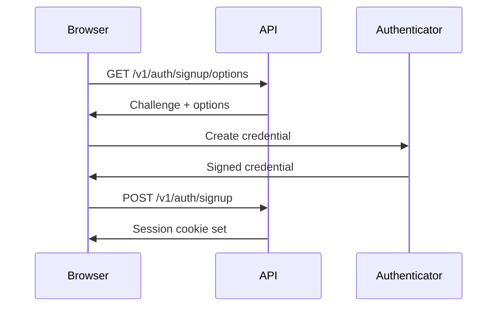

## Overview

Dashboard authentication uses WebAuthn (passkeys) and JWT session cookies to authenticate namespace owners. This allows owners to manage services, approve authorization requests, and configure their namespace through the Sigilum dashboard.

<Info>
Dashboard auth is only needed for namespace owner management operations. **Services** authenticate using API keys (Bearer tokens), and **agents** use signed request headers.
</Info>

## Authentication Flow

The authentication flow follows the WebAuthn standard with passkeys:



## Signup

### Get Signup Options

<ParamField path="GET /v1/auth/signup/options" type="endpoint">
  Request WebAuthn challenge and options for creating a new account.
</ParamField>

**Query Parameters:**

<ParamField path="namespace" type="string" required>
  Desired namespace (must be available)
</ParamField>

**Response:**

<ResponseField name="challenge" type="string">
  Base64-encoded WebAuthn challenge
</ResponseField>

<ResponseField name="rp" type="object">
  Relying party information (name and ID)
</ResponseField>

<ResponseField name="user" type="object">
  User information for credential creation
</ResponseField>

<ResponseField name="pubKeyCredParams" type="array">
  Supported credential algorithms (ES256, EdDSA)
</ResponseField>

**Example:**

```bash
curl https://api.sigilum.id/v1/auth/signup/options?namespace=acme
```

### Create Account

<ParamField path="POST /v1/auth/signup" type="endpoint">
  Complete account creation with signed WebAuthn credential.
</ParamField>

**Request Body:**

<ParamField path="namespace" type="string" required>
  Namespace to register
</ParamField>

<ParamField path="passkey_name" type="string">
  Optional name for the passkey (e.g., "MacBook Pro")
</ParamField>

<ParamField path="credential" type="object" required>
  WebAuthn credential response from `navigator.credentials.create()`
</ParamField>

**Response:**

Returns 201 Created with session cookie set. The `Set-Cookie` header contains the JWT session token.

<Note>
After signup, the namespace is reserved and a DID document is created at `did:sigilum:{namespace}`.
</Note>

## Login

### Get Login Options

<ParamField path="GET /v1/auth/login/options" type="endpoint">
  Request WebAuthn challenge for authentication.
</ParamField>

**Query Parameters:**

<ParamField path="namespace" type="string" required>
  Namespace to authenticate
</ParamField>

**Response:**

<ResponseField name="challenge" type="string">
  Base64-encoded WebAuthn challenge
</ResponseField>

<ResponseField name="allowCredentials" type="array">
  List of credential IDs allowed for this namespace
</ResponseField>

### Authenticate

<ParamField path="POST /v1/auth/login" type="endpoint">
  Complete authentication with signed WebAuthn assertion.
</ParamField>

**Request Body:**

<ParamField path="namespace" type="string" required>
  Namespace to authenticate
</ParamField>

<ParamField path="credential" type="object" required>
  WebAuthn assertion response from `navigator.credentials.get()`
</ParamField>

**Response:**

Returns 200 OK with session cookie set.

## Session Management

### Get Current User

<ParamField path="GET /v1/auth/me" type="endpoint">
  Retrieve information about the currently authenticated user.
</ParamField>

**Authentication:** Cookie-based session

**Response:**

<ResponseField name="namespace" type="string">
  Authenticated namespace
</ResponseField>

<ResponseField name="settings" type="object">
  User settings and preferences
</ResponseField>

<ResponseField name="created_at" type="string">
  Account creation timestamp
</ResponseField>

### Logout

<ParamField path="POST /v1/auth/logout" type="endpoint">
  End the current session and clear the session cookie.
</ParamField>

**Authentication:** Cookie-based session

**Response:** Returns 200 OK with `Set-Cookie` header clearing the session.

## Passkey Management

### Get Passkey Options

<ParamField path="GET /v1/auth/passkeys/options" type="endpoint">
  Request WebAuthn options for adding a new passkey to the account.
</ParamField>

**Authentication:** Cookie-based session

**Response:** WebAuthn credential creation options

### Add Passkey

<ParamField path="POST /v1/auth/passkeys" type="endpoint">
  Add a new passkey to the authenticated account.
</ParamField>

**Request Body:**

<ParamField path="passkey_name" type="string">
  Name for the new passkey (e.g., "iPhone", "YubiKey")
</ParamField>

<ParamField path="credential" type="object" required>
  WebAuthn credential response
</ParamField>

**Response:** Returns the created passkey object (201 Created)

### List Passkeys

<ParamField path="GET /v1/auth/passkeys" type="endpoint">
  List all passkeys associated with the account.
</ParamField>

**Response:**

<ResponseField name="passkeys" type="array">
  <Expandable title="Passkey Object">
    <ResponseField name="id" type="string">
      Passkey ID
    </ResponseField>
    <ResponseField name="name" type="string">
      User-assigned name
    </ResponseField>
    <ResponseField name="created_at" type="string">
      Creation timestamp
    </ResponseField>
    <ResponseField name="last_used_at" type="string">
      Last authentication timestamp (null if never used)
    </ResponseField>
  </Expandable>
</ResponseField>

### Rename Passkey

<ParamField path="PATCH /v1/auth/passkeys/{id}" type="endpoint">
  Update the name of a passkey.
</ParamField>

**Request Body:**

<ParamField path="name" type="string" required>
  New passkey name
</ParamField>

### Delete Passkey

<ParamField path="DELETE /v1/auth/passkeys/{id}" type="endpoint">
  Remove a passkey from the account.
</ParamField>

<Warning>
Ensure you have at least one passkey remaining before deleting. Otherwise, you will be locked out of your account.
</Warning>

## Account Settings

### Update Settings

<ParamField path="PATCH /v1/auth/settings" type="endpoint">
  Update account settings and preferences.
</ParamField>

**Request Body:**

<ParamField path="email_notifications" type="boolean">
  Enable or disable email notifications
</ParamField>

<ParamField path="webhook_failures_notify" type="boolean">
  Receive notifications for webhook delivery failures
</ParamField>

### Delete Account

<ParamField path="DELETE /v1/auth/account" type="endpoint">
  Permanently delete the namespace and all associated data.
</ParamField>

<Warning>
This action is **irreversible**. All services, API keys, authorization requests, and webhooks will be permanently deleted.
</Warning>

**Authentication:** Requires reauthentication (recent passkey verification)

## Session Cookies

Session cookies are HTTP-only, secure, and have the following properties:

- **Name:** `sigilum_session`
- **Duration:** 7 days (configurable via `GATEWAY_AUTH_SESSION_HOURS`)
- **SameSite:** `Lax`
- **Secure:** `true` (HTTPS only)

The cookie contains a signed JWT with the namespace claim:

```json
{
  "namespace": "acme",
  "iat": 1234567890,
  "exp": 1235172690
}
```

## Security Considerations

<Accordion title="WebAuthn Security">
WebAuthn provides strong cryptographic authentication:

- **Phishing resistant:** Credentials are bound to the origin
- **No shared secrets:** Private keys never leave the authenticator
- **Replay protection:** Each authentication uses a unique challenge
- **Attestation:** Optional device attestation for high-security scenarios
</Accordion>

<Accordion title="Session Security">
Sessions are protected with:

- **HTTP-only cookies:** JavaScript cannot access tokens
- **Secure flag:** Transmitted only over HTTPS
- **SameSite:** CSRF protection
- **JWT signing:** HMAC-SHA256 with server secret
- **Expiration:** Automatic session timeout
</Accordion>

<Accordion title="Rate Limiting">
Authentication endpoints have strict rate limits:

- **Signup:** 5 attempts per IP per hour
- **Login:** 10 attempts per namespace per hour
- **Failed attempts trigger exponential backoff**
</Accordion>

## Browser Integration Example

Complete signup flow using the WebAuthn browser API:

```typescript
// Step 1: Get signup options
const optionsResponse = await fetch(
  'https://api.sigilum.id/v1/auth/signup/options?namespace=acme'
);
const options = await optionsResponse.json();

// Step 2: Create credential
const credential = await navigator.credentials.create({
  publicKey: {
    challenge: Uint8Array.from(atob(options.challenge), c => c.charCodeAt(0)),
    rp: options.rp,
    user: options.user,
    pubKeyCredParams: options.pubKeyCredParams,
    authenticatorSelection: {
      authenticatorAttachment: 'platform',
      userVerification: 'required'
    }
  }
});

// Step 3: Complete signup
const signupResponse = await fetch('https://api.sigilum.id/v1/auth/signup', {
  method: 'POST',
  credentials: 'include', // Include cookies
  headers: { 'Content-Type': 'application/json' },
  body: JSON.stringify({
    namespace: 'acme',
    passkey_name: 'MacBook Pro',
    credential: {
      id: credential.id,
      rawId: btoa(String.fromCharCode(...new Uint8Array(credential.rawId))),
      response: {
        clientDataJSON: btoa(String.fromCharCode(...new Uint8Array(credential.response.clientDataJSON))),
        attestationObject: btoa(String.fromCharCode(...new Uint8Array(credential.response.attestationObject)))
      },
      type: credential.type
    }
  })
});

// Session cookie is now set
console.log('Authenticated!');
```

## Next Steps

<CardGroup cols={2}>
  <Card title="Services Management" icon="gears" href="/api-reference/services">
    Create services and generate API keys
  </Card>
  <Card title="Authorizations" icon="shield-check" href="/api-reference/authorizations">
    Approve agent authorization requests
  </Card>
  <Card title="Namespaces" icon="sitemap" href="/api-reference/namespaces">
    View authorization requests for your namespace
  </Card>
  <Card title="Dashboard" icon="browser" href="https://sigilum.id">
    Use the web dashboard instead of API calls
  </Card>
</CardGroup>
