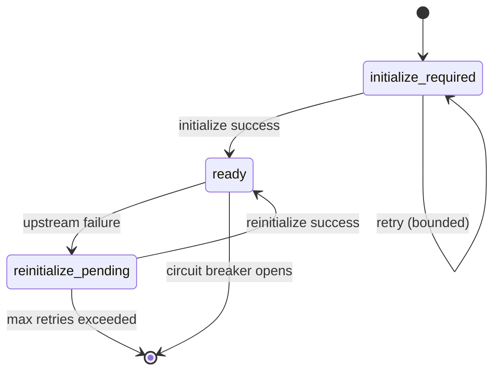

## Overview

Gateway provides a runtime API for Model Context Protocol (MCP) connections with:

- **Discovery** - Automatic tool discovery from MCP servers with caching
- **Filtering** - Connection-level and per-subject tool policies (allow/deny lists)
- **Execution** - Validated tool calls with circuit breaker protection
- **Explain** - Policy decision transparency for tool access

MCP connections use `protocol: "mcp"` and communicate via streamable HTTP transport.

## MCP Session Lifecycle

Gateway maintains explicit MCP session states:



- **initialize_required** - New connection, needs MCP `initialize` call
- **ready** - Session active, tools available
- **reinitialize_pending** - Temporary failure, attempting recovery

## Discovery Cache Policy

Gateway caches MCP discovery results with TTL and stale-if-error fallback:

```bash
GATEWAY_MCP_DISCOVERY_CACHE_TTL_SECONDS=300        # Fresh cache window
GATEWAY_MCP_DISCOVERY_STALE_IF_ERROR_SECONDS=3600  # Stale fallback window
```

**Cache Behavior:**

1. **Fresh** (within TTL) - Return cached results immediately
2. **Stale** (past TTL, within stale-if-error) - Attempt refresh, fall back to stale on error
3. **Expired** (past stale-if-error) - Force refresh, fail if unavailable

## Circuit Breaker

Gateway opens a per-connection circuit breaker after repeated upstream failures:

```bash
GATEWAY_MCP_CIRCUIT_BREAKER_FAILURES=3          # Failures before opening
GATEWAY_MCP_CIRCUIT_BREAKER_COOLDOWN_SECONDS=10 # Fail-fast duration
```

When open, all requests fail immediately with `503 Service Unavailable` until cooldown elapses.

## List MCP Tools

<api method="get" endpoint="/mcp/{connection_id}/tools">
  List filtered MCP tools for the signed subject
</api>

<ParamField path="connection_id" type="string" required>
  MCP connection identifier (must have `protocol: "mcp"`)
</ParamField>

<ParamField query="refresh" type="string" default="auto">
  Discovery refresh mode:
  - `auto` - Use cache policy (default)
  - `force` - Bypass cache and refresh from upstream
</ParamField>

### Required Headers

<ParamField header="signature-input" type="string" required>
  RFC 9421 Signature-Input header (same as proxy endpoints)
</ParamField>

<ParamField header="signature" type="string" required>
  RFC 9421 Signature header
</ParamField>

<ParamField header="sigilum-namespace" type="string" required>
  Namespace identifier
</ParamField>

<ParamField header="sigilum-subject" type="string" required>
  Subject identifier for tool policy filtering
</ParamField>

<ParamField header="sigilum-agent-key" type="string" required>
  Public key of signing agent
</ParamField>

<ParamField header="sigilum-agent-cert" type="string" required>
  Agent certificate
</ParamField>

### Response

<ResponseField name="tools" type="array" required>
  List of MCP tools filtered by subject policy
  
  <Expandable title="Tool Object">
    <ResponseField name="name" type="string" required>
      Tool identifier (e.g., `linear.searchIssues`)
    </ResponseField>
    
    <ResponseField name="description" type="string">
      Human-readable tool description
    </ResponseField>
    
    <ResponseField name="input_schema" type="string">
      JSON Schema for tool input arguments
    </ResponseField>
  </Expandable>
</ResponseField>

<ResponseField name="server" type="object">
  MCP server metadata
  
  <Expandable title="Server Info">
    <ResponseField name="name" type="string">
      Server name
    </ResponseField>
    
    <ResponseField name="version" type="string">
      Server version
    </ResponseField>
    
    <ResponseField name="protocol_version" type="string">
      MCP protocol version
    </ResponseField>
  </Expandable>
</ResponseField>

<ResponseField name="last_discovered_at" type="string">
  RFC3339 timestamp of last successful discovery
</ResponseField>

### Example Request

```bash
curl -X GET 'http://localhost:38100/mcp/linear-mcp/tools?refresh=auto' \
  -H 'signature-input: sig1=("@method" "@path" "@authority" "sigilum-namespace" "sigilum-subject" "sigilum-agent-key" "sigilum-nonce");created=1709550000;keyid="key-abc";nonce="nonce_xyz"' \
  -H 'signature: sig1=:MEUCIA...:' \
  -H 'sigilum-namespace: acme-corp' \
  -H 'sigilum-subject: user_alice' \
  -H 'sigilum-agent-key: MFkwEwYHK...' \
  -H 'sigilum-agent-cert: MIIBkTC...' \
  -H 'sigilum-nonce: nonce_xyz'
```

### Example Response

```json
{
  "tools": [
    {
      "name": "linear.searchIssues",
      "description": "Search Linear issues by text query",
      "input_schema": "{\"type\":\"object\",\"properties\":{\"query\":{\"type\":\"string\"}},\"required\":[\"query\"]}"
    },
    {
      "name": "linear.getIssue",
      "description": "Get a specific Linear issue by ID",
      "input_schema": "{\"type\":\"object\",\"properties\":{\"id\":{\"type\":\"string\"}},\"required\":[\"id\"]}"
    }
  ],
  "server": {
    "name": "linear-mcp-server",
    "version": "1.0.0",
    "protocol_version": "2024-11-05"
  },
  "last_discovered_at": "2026-03-04T10:25:00Z"
}
```

<Note>
Tools are filtered by connection-level and subject-level policies before returning. Denied tools are excluded from the response.
</Note>

## Explain Tool Policy

<api method="get" endpoint="/mcp/{connection_id}/tools/{tool}/explain">
  Explain whether a tool is allowed or denied for the signed subject
</api>

<ParamField path="connection_id" type="string" required>
  MCP connection identifier
</ParamField>

<ParamField path="tool" type="string" required>
  Tool name (e.g., `linear.searchIssues`)
</ParamField>

<ParamField query="refresh" type="string" default="auto">
  Discovery refresh mode (`auto` or `force`)
</ParamField>

### Response

<ResponseField name="tool" type="string" required>
  Tool name being explained
</ResponseField>

<ResponseField name="allowed" type="boolean" required>
  Whether the tool is allowed for the subject
</ResponseField>

<ResponseField name="policy_source" type="string" required>
  Policy decision source:
  - `connection_allowlist` - Connection-level allowlist
  - `connection_denylist` - Connection-level denylist
  - `subject_allowlist` - Subject-specific allowlist
  - `subject_denylist` - Subject-specific denylist
  - `default_allow` - No explicit policy, default allow
</ResponseField>

<ResponseField name="subject" type="string">
  Subject identifier from request
</ResponseField>

### Example Request

```bash
curl -X GET 'http://localhost:38100/mcp/linear-mcp/tools/linear.createIssue/explain' \
  -H 'signature-input: ...' \
  -H 'signature: ...' \
  -H 'sigilum-namespace: acme-corp' \
  -H 'sigilum-subject: user_alice' \
  -H 'sigilum-agent-key: ...' \
  -H 'sigilum-agent-cert: ...'
```

### Example Response (Denied)

```json
{
  "tool": "linear.createIssue",
  "allowed": false,
  "policy_source": "connection_denylist",
  "subject": "user_alice"
}
```

### Example Response (Allowed)

```json
{
  "tool": "linear.searchIssues",
  "allowed": true,
  "policy_source": "connection_allowlist",
  "subject": "user_alice"
}
```

<Tip>
Use `/explain` to debug tool access issues before attempting execution. This helps understand why a tool may be missing from `/tools` list.
</Tip>

## Call MCP Tool

<api method="post" endpoint="/mcp/{connection_id}/tools/{tool}/call">
  Execute an MCP tool with arguments
</api>

<ParamField path="connection_id" type="string" required>
  MCP connection identifier
</ParamField>

<ParamField path="tool" type="string" required>
  Tool name to execute (must be in allowlist)
</ParamField>

<ParamField query="refresh" type="string" default="auto">
  Discovery refresh mode (`auto` or `force`)
</ParamField>

### Request Body

<ParamField body="arguments" type="object">
  Tool-specific input arguments (validated against tool's input_schema)
</ParamField>

### Response

<ResponseField name="content" type="array" required>
  Tool execution results as MCP content blocks
  
  <Expandable title="Content Block">
    <ResponseField name="type" type="string" required>
      Content type (e.g., `text`, `image`, `resource`)
    </ResponseField>
    
    <ResponseField name="text" type="string">
      Text content (for `type: "text"`)
    </ResponseField>
  </Expandable>
</ResponseField>

<ResponseField name="isError" type="boolean">
  Whether the tool execution failed
</ResponseField>

### Example Request

```bash
curl -X POST 'http://localhost:38100/mcp/linear-mcp/tools/linear.searchIssues/call' \
  -H 'Content-Type: application/json' \
  -H 'signature-input: sig1=("@method" "@path" "@authority" "content-digest" "sigilum-namespace" "sigilum-subject" "sigilum-agent-key" "sigilum-nonce");created=1709550000;keyid="key-abc";nonce="nonce_xyz2"' \
  -H 'signature: sig1=:MEUCIA...:' \
  -H 'sigilum-namespace: acme-corp' \
  -H 'sigilum-subject: user_alice' \
  -H 'sigilum-agent-key: MFkwEwYHK...' \
  -H 'sigilum-agent-cert: MIIBkTC...' \
  -H 'sigilum-nonce: nonce_xyz2' \
  -H 'content-digest: sha-256=:X48E9qOokqqrvdts8nOJRJN3OWDUoyWxBf7kbu9DBPE=:' \
  -d '{
    "arguments": {
      "query": "bug in authentication"
    }
  }'
```

### Example Response (Success)

```json
{
  "content": [
    {
      "type": "text",
      "text": "Found 3 issues:\n1. AUTH-123: Login fails with invalid token\n2. AUTH-456: Session timeout not enforced\n3. AUTH-789: Password reset email broken"
    }
  ],
  "isError": false
}
```

### Example Response (Tool Error)

```json
{
  "content": [
    {
      "type": "text",
      "text": "Linear API error: Invalid query syntax"
    }
  ],
  "isError": true
}
```

### Example Response (Tool Denied)

```json
{
  "error": "tool not allowed for subject",
  "code": "MCP_TOOL_DENIED",
  "request_id": "req_abc123",
  "timestamp": "2026-03-04T10:40:00Z"
}
```

## Tool Filtering Policies

Gateway applies multi-level tool filtering:

### 1. Connection-Level Policy

Applies to all subjects using the connection:

```json
{
  "id": "linear-mcp",
  "protocol": "mcp",
  "mcp_tool_policy": {
    "allowlist": ["linear.searchIssues", "linear.getIssue"],
    "denylist": ["linear.deleteIssue"],
    "max_tools_exposed": 10
  }
}
```

<ParamField body="allowlist" type="array<string>">
  Explicit tool names to allow (if present, only these tools are exposed)
</ParamField>

<ParamField body="denylist" type="array<string>">
  Explicit tool names to deny (takes precedence over allowlist)
</ParamField>

<ParamField body="max_tools_exposed" type="integer">
  Maximum number of tools to expose (additional tools truncated)
</ParamField>

### 2. Subject-Level Policy

Overrides connection policy for specific subjects:

```json
{
  "id": "linear-mcp",
  "protocol": "mcp",
  "mcp_subject_tool_policies": {
    "user_alice": {
      "allowlist": ["linear.searchIssues"],
      "denylist": ["linear.createIssue", "linear.updateIssue"]
    },
    "admin_bob": {
      "allowlist": ["linear.*"]
    }
  }
}
```

<Note>
Subject policies are keyed by `sigilum-subject` header value. Wildcard patterns are supported in allowlist/denylist.
</Note>

### Policy Evaluation Order

1. Check subject-level denylist → **deny** if matched
2. Check subject-level allowlist → **allow** if matched, **deny** if allowlist present but not matched
3. Check connection-level denylist → **deny** if matched
4. Check connection-level allowlist → **allow** if matched, **deny** if allowlist present but not matched
5. Default → **allow**

## Rate Limiting

MCP tool calls are rate-limited per connection + namespace:

```bash
GATEWAY_MCP_TOOL_CALL_RATE_LIMIT_PER_MINUTE=120  # Set 0 to disable
```

**Response (429 Too Many Requests):**

```json
{
  "error": "tool call rate limit exceeded",
  "code": "MCP_TOOL_CALL_RATE_LIMITED",
  "request_id": "req_xyz789",
  "timestamp": "2026-03-04T10:45:00Z"
}
```

## Retry Behavior

Gateway retries MCP requests only for retryable conditions:

**Retryable:**
- Network timeouts
- HTTP 429 (Too Many Requests)
- HTTP 502, 503, 504 (Temporary upstream failures)

**Non-Retryable:**
- HTTP 4xx (except 429)
- Tool policy denials
- Invalid request formats

Retries use bounded exponential backoff with jitter.

## MCP Connection Configuration

### HTTP MCP Connection

```json
{
  "id": "linear-mcp",
  "name": "Linear MCP",
  "protocol": "mcp",
  "base_url": "https://mcp.linear.app",
  "mcp_transport": "streamable_http",
  "mcp_endpoint": "/mcp",
  "auth_mode": "bearer",
  "auth_header_name": "Authorization",
  "auth_prefix": "Bearer ",
  "auth_secret_key": "api_key",
  "secrets": {
    "api_key": "lin_api_abc123xyz789"
  },
  "mcp_tool_policy": {
    "allowlist": ["linear.searchIssues", "linear.getIssue"],
    "denylist": ["linear.deleteIssue"]
  }
}
```

### MCP with Query Parameter Auth

```json
{
  "id": "typefully-mcp",
  "name": "Typefully MCP",
  "protocol": "mcp",
  "base_url": "https://mcp.typefully.com",
  "mcp_transport": "streamable_http",
  "mcp_endpoint": "https://mcp.typefully.com/mcp?TYPEFULLY_API_KEY={{__API_KEY__}}",
  "auth_mode": "query_param",
  "auth_header_name": "TYPEFULLY_API_KEY",
  "auth_secret_key": "__API_KEY__",
  "secrets": {
    "__API_KEY__": "tf_secret_xyz789"
  }
}
```

<Note>
MCP connections support optional auth secrets. Only configure `auth_mode` and `secrets` when the upstream MCP server requires credentials.
</Note>

## Discovery Workflow

To set up a new MCP connection:

1. **Create Connection** via `POST /api/admin/connections` with `protocol: "mcp"`
2. **Run Discovery** via `POST /api/admin/connections/{id}/discover?refresh=force`
3. **Review Tools** in `mcp_discovery.tools` field
4. **Configure Policies** via `PATCH /api/admin/connections/{id}` to set allowlist/denylist
5. **Test Runtime** via `GET /mcp/{id}/tools` with signed request

See [Admin Endpoints](/api-reference/gateway/admin) for discovery API details.

## Error Scenarios

### Circuit Breaker Open

```json
{
  "error": "mcp circuit breaker open",
  "code": "MCP_CIRCUIT_OPEN",
  "request_id": "req_circuit123",
  "timestamp": "2026-03-04T10:50:00Z"
}
```

### Discovery Cache Unavailable

```json
{
  "error": "mcp discovery cache expired and refresh failed",
  "code": "MCP_DISCOVERY_UNAVAILABLE",
  "request_id": "req_cache456",
  "timestamp": "2026-03-04T10:51:00Z"
}
```

### Invalid Tool Arguments

```json
{
  "error": "tool arguments do not match input schema",
  "code": "MCP_INVALID_ARGUMENTS",
  "request_id": "req_args789",
  "timestamp": "2026-03-04T10:52:00Z"
}
```

## Next Steps

<CardGroup cols={2}>
  <Card title="Admin Endpoints" icon="arrow-right" href="/api-reference/gateway/admin">
    Learn how to create and discover MCP connections
  </Card>
  <Card title="Proxy Endpoints" icon="arrow-right" href="/api-reference/gateway/proxy">
    Explore HTTP proxy functionality
  </Card>
</CardGroup>