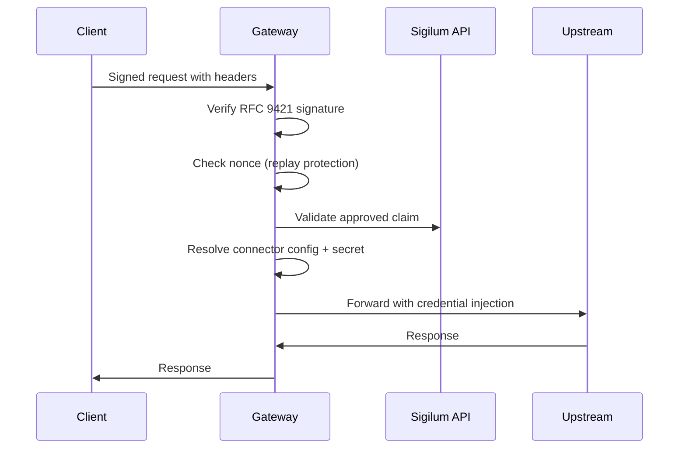

## What is Gateway?

Sigilum Gateway is a local reverse-proxy service that enforces Sigilum signed-auth and approved-claim checks before forwarding requests to third-party APIs with connector-managed credentials.

Gateway validates incoming requests through a multi-stage authorization pipeline:

1. **Signature verification** - Validates RFC 9421 HTTP Message Signatures
2. **Nonce replay protection** - Prevents request replay attacks
3. **Claim validation** - Confirms caller is approved for the requested service
4. **Upstream forwarding** - Routes to configured connectors with credential injection

## Architecture

Gateway operates as a local, single-instance service with:

- **BadgerDB storage** for encrypted connector secrets
- **In-memory nonce cache** for replay protection (process-local)
- **Claims cache** synchronized with Sigilum API approved claims feed
- **MCP runtime** for Model Context Protocol connections with discovery and tool filtering

<Note>
Gateway is designed for **local operation only**. Nonce replay protection is process-local and resets on restart. For production multi-instance deployments, additional coordination is required.
</Note>

## API Surface

The Gateway API is organized into four functional areas:

### Health & Metrics

- `GET /health` - Overall health status
- `GET /health/live` - Liveness probe
- `GET /health/ready` - Readiness probe with dependency checks
- `GET /metrics` - Prometheus metrics (admin access policy enforced)

### Proxy Runtime

- `/{method} /proxy/{connection_id}/{path}` - HTTP proxy with signature verification
- `/{method} /slack/{path}` - Slack-specific alias (maps to `slack-proxy` connection)

See [Proxy Endpoints](/api-reference/gateway/proxy) for details.

### MCP Runtime

- `GET /mcp/{connection_id}/tools` - List filtered MCP tools
- `GET /mcp/{connection_id}/tools/{tool}/explain` - Explain tool policy decision
- `POST /mcp/{connection_id}/tools/{tool}/call` - Execute MCP tool

See [MCP Runtime Endpoints](/api-reference/gateway/mcp) for details.

### Admin

- Connection CRUD: `GET/POST/PATCH/DELETE /api/admin/connections`
- Connection operations: `/api/admin/connections/{id}/test`, `/api/admin/connections/{id}/rotate`, `/api/admin/connections/{id}/discover`
- Shared credentials: `GET/POST/DELETE /api/admin/credential-variables`
- Service catalog: `GET/PUT /api/admin/service-catalog`

See [Admin Endpoints](/api-reference/gateway/admin) for details.

## Request Flow (Proxy)

When a client sends a signed request to a proxy endpoint:



### Required Signature Headers

All proxy and MCP runtime requests require these signed headers:

<ParamField header="signature-input" type="string" required>
  RFC 9421 Signature-Input header defining signed components and parameters
</ParamField>

<ParamField header="signature" type="string" required>
  RFC 9421 Signature header containing the cryptographic signature
</ParamField>

<ParamField header="sigilum-namespace" type="string" required>
  Sigilum namespace identifier for the requesting organization
</ParamField>

<ParamField header="sigilum-subject" type="string" required>
  Stable requester identifier within the namespace (user ID, employee ID, or principal)
</ParamField>

<ParamField header="sigilum-agent-key" type="string" required>
  Base64-encoded public key of the signing agent
</ParamField>

<ParamField header="sigilum-agent-cert" type="string" required>
  Agent certificate for signature verification
</ParamField>

## Error Envelope

All error responses use a consistent JSON structure:

<ResponseField name="error" type="string" required>
  Human-readable error summary
</ResponseField>

<ResponseField name="code" type="string">
  Stable machine-readable error code (see taxonomy below)
</ResponseField>

<ResponseField name="request_id" type="string">
  Correlation ID for logs and traces
</ResponseField>

<ResponseField name="timestamp" type="string">
  RFC3339 UTC timestamp of the error
</ResponseField>

<ResponseField name="docs_url" type="string">
  Reference URL for error remediation documentation
</ResponseField>

### Example Error Response

```json
{
  "error": "replay detected",
  "code": "AUTH_REPLAY_DETECTED",
  "request_id": "req_abc123",
  "timestamp": "2026-03-04T10:30:00Z",
  "docs_url": "https://docs.sigilum.id/gateway-errors#AUTH_REPLAY_DETECTED"
}
```

## Auth Failure Code Taxonomy

Gateway returns deterministic auth failure codes for client error handling:

| Code | Description | HTTP Status |
|------|-------------|-------------|
| `AUTH_HEADERS_INVALID` | Duplicate or malformed signed headers | 403 |
| `AUTH_SIGNATURE_INVALID` | RFC 9421 signature verification failed | 403 |
| `AUTH_SIGNED_COMPONENTS_INVALID` | Signed component list doesn't match required profile | 403 |
| `AUTH_IDENTITY_INVALID` | Missing or invalid Sigilum identity headers | 403 |
| `AUTH_NONCE_INVALID` | Signature nonce missing or malformed | 403 |
| `AUTH_REPLAY_DETECTED` | Nonce already seen within replay window | 403 |
| `AUTH_CLAIMS_UNAVAILABLE` | Gateway claim cache is unavailable | 503 |
| `AUTH_CLAIMS_LOOKUP_FAILED` | Claim cache lookup failed | 500 |
| `AUTH_CLAIM_REQUIRED` | Caller not approved for requested service | 403 |
| `AUTH_CLAIM_SUBMIT_RATE_LIMITED` | Auto-claim registration temporarily rate-limited | 429 |
| `AUTH_FORBIDDEN` | Generic auth denial fallback | 403 |

<Tip>
Clients should implement specific handling for `AUTH_REPLAY_DETECTED` (retry with new nonce) and `AUTH_CLAIM_REQUIRED` (initiate approval flow).
</Tip>

## Protocol Support

Gateway supports two connection protocols:

### HTTP Protocol (`protocol: "http"`)

- Request path: `/proxy/{connection_id}/{path}`
- Requires upstream auth secret configuration
- Supports auth modes: `bearer`, `header_key`, `query_param`

### MCP Protocol (`protocol: "mcp"`)

- Runtime paths: `/mcp/{connection_id}/tools`, `/mcp/{connection_id}/tools/{tool}/call`, etc.
- Optional auth secret (only when upstream requires credentials)
- Supports discovery with cache policy (TTL + stale-if-error)
- Per-subject tool policy filtering
- Circuit breaker for upstream reliability

## Rate Limiting

Gateway enforces per-connection and per-namespace rate limits:

<ParamField query="GATEWAY_CLAIM_REGISTRATION_RATE_LIMIT_PER_MINUTE" type="integer" default="30">
  Claim registration attempts per connection + namespace (set `0` to disable)
</ParamField>

<ParamField query="GATEWAY_MCP_TOOL_CALL_RATE_LIMIT_PER_MINUTE" type="integer" default="120">
  MCP tool call bursts per connection + namespace (set `0` to disable)
</ParamField>

## Timeouts

Gateway applies route-class timeouts:

| Route Class | Default Timeout | Environment Variable |
|-------------|-----------------|---------------------|
| Admin | 20s | `GATEWAY_ADMIN_TIMEOUT_SECONDS` |
| Proxy | 120s | `GATEWAY_PROXY_TIMEOUT_SECONDS` |
| MCP Runtime | 90s | `GATEWAY_MCP_TIMEOUT_SECONDS` |

## Metrics

Gateway exposes Prometheus-style metrics at `GET /metrics`:

```
sigilum_gateway_auth_reject_total{reason="..."}
sigilum_gateway_replay_detected_total
sigilum_gateway_upstream_requests_total{protocol="...",outcome="..."}
sigilum_gateway_upstream_latency_seconds_{count,sum}{protocol="...",outcome="..."}
sigilum_gateway_upstream_error_total{class="..."}
sigilum_gateway_mcp_discovery_total{result="..."}
sigilum_gateway_mcp_tool_call_total{result="..."}
sigilum_gateway_requests_in_flight
sigilum_gateway_shutdown_drain_total{outcome="..."}
sigilum_gateway_shutdown_drain_seconds_{count,sum}{outcome="..."}
```

<Note>
The `/metrics` endpoint requires admin access policy enforcement. Configure `GATEWAY_ADMIN_ACCESS_MODE` appropriately.
</Note>

## Next Steps

<CardGroup cols={2}>
  <Card title="Proxy Endpoints" icon="arrow-right" href="/api-reference/gateway/proxy">
    Learn about HTTP proxy request flow and signature verification
  </Card>
  <Card title="MCP Runtime" icon="arrow-right" href="/api-reference/gateway/mcp">
    Explore MCP tool discovery, filtering, and execution
  </Card>
  <Card title="Admin Endpoints" icon="arrow-right" href="/api-reference/gateway/admin">
    Manage connections, credentials, and service catalog
  </Card>
</CardGroup>