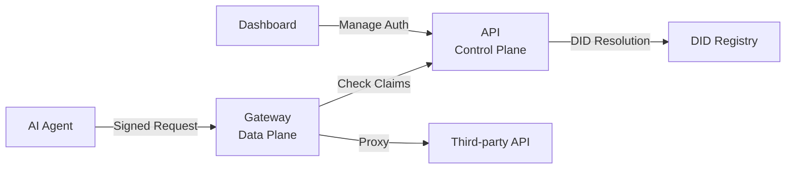

The Sigilum API (`@sigilum/api`) is the backend control plane for namespace-based agent authorization. It manages namespace identities, authorization request lifecycles, DID resolution, and dashboard authentication.

## Architecture Role

The API serves as the **control plane** in Sigilum's architecture:

- **Control Plane (API)**: Manages identity, authorization state, and audit logs
- **Data Plane (Gateway)**: Enforces approved claims and proxies requests to third-party APIs
- **SDK Layer**: Libraries that sign requests and verify authorization



## Core Features

### Namespace Identity

- Each namespace receives a unique DID: `did:sigilum:<namespace>`
- DID documents expose verification methods and approved service endpoints
- Ed25519 key pairs for agent signing
- WebAuthn passkey authentication for namespace owners

### Authorization Lifecycle

The API manages a complete request-approve-revoke flow:

1. **Submit**: Service submits authorization request with signed headers
2. **Approve/Reject**: Namespace owner reviews and approves/rejects
3. **Verify**: Service checks authorization status via `/v1/verify` or claims feed
4. **Revoke**: Owner can revoke approved authorization at any time

### DID Resolution

Expose namespace identity as W3C DID documents:

- `/.well-known/did/{did}` - DID document (application/did+json)
- `/1.0/identifiers/{did}` - DID resolution envelope
- Includes verification methods, authentication relationships, and service endpoints

### Webhook Delivery

- Durable webhook delivery for authorization lifecycle events
- Events: `request.submitted`, `request.approved`, `request.rejected`, `request.revoked`
- Exponential backoff with configurable retry window
- Terminal failure email alerts via Resend

### Blockchain Audit Log

Optional on-chain audit trail:

- Records authorization approvals and revocations
- Supports testnet (Sepolia) and mainnet (Base)
- Multiple modes: `queue`, `sync`, `memory`, `disabled`

## Deployment

The API is built on **Cloudflare Workers** using Hono framework with an adapter architecture:

### Runtime Stack

- **Framework**: Hono
- **Platform**: Cloudflare Workers (default adapter)
- **Database**: D1 (SQLite at edge)
- **Durable Storage**: Durable Objects (nonce replay protection)
- **Queues**: Webhook queue, blockchain queue

### Required Bindings

<Accordion title="Cloudflare Worker Bindings">

```toml
# wrangler.toml

[[d1_databases]]
binding = "DB"
database_name = "sigilum-api"
database_id = "<your-d1-database-id>"

[[durable_objects.bindings]]
name = "NONCE_STORE_DO"
class_name = "NonceStoreDO"
script_name = "sigilum-api"

[[queues.producers]]
queue = "webhook-queue"
binding = "WEBHOOK_QUEUE"

[[queues.producers]]
queue = "blockchain-queue"
binding = "BLOCKCHAIN_QUEUE"
```

</Accordion>

### Local Development

```bash
# Install dependencies
pnpm install

# Copy environment template
cd apps/api
cp .dev.vars.example .dev.vars

# Apply D1 migrations
pnpm exec wrangler d1 migrations apply sigilum-api --local

# Start local dev server
pnpm --filter @sigilum/api dev
```

The API runs on `http://localhost:8787` by default.

## API Endpoints

All protected endpoints require **Sigilum signed headers**:

- `signature-input`
- `signature`
- `sigilum-namespace`
- `sigilum-subject`
- `sigilum-agent-key`
- `sigilum-agent-cert`
- `content-digest` (when request body is present)

### Health

```bash
GET /health
```

Returns health status with timestamp.

### Authentication (Dashboard)

<Accordion title="Dashboard Auth Endpoints">

WebAuthn passkey-based authentication for namespace owners:

```bash
# Signup flow
GET  /v1/auth/signup/options?email=<email>&namespace=<namespace>
POST /v1/auth/signup

# Login flow
GET  /v1/auth/login/options
POST /v1/auth/login

# Session management
GET  /v1/auth/me
POST /v1/auth/logout

# Passkey management
GET    /v1/auth/passkeys
POST   /v1/auth/passkeys
PATCH  /v1/auth/passkeys/{id}
DELETE /v1/auth/passkeys/{id}

# Account settings
PATCH  /v1/auth/settings
DELETE /v1/auth/account
```

</Accordion>

### Namespaces & Verification

```bash
# Get namespace metadata
GET /v1/namespaces/{namespace}

# List namespace authorizations (owner auth required)
GET /v1/namespaces/{namespace}/claims

# Get approved claims feed (service API key required)
GET /v1/namespaces/claims?service=<service_slug>

# Verify agent authorization
GET /v1/verify?namespace=<ns>&public_key=<key>&service=<slug>
```

### Authorization Requests

```bash
# Submit authorization request (service API key required)
POST /v1/claims

# Get authorization details (owner auth required)
GET /v1/claims/{claimId}

# Approve authorization (owner auth required)
POST /v1/claims/{claimId}/approve

# Reject authorization (owner auth required)
POST /v1/claims/{claimId}/reject

# Revoke authorization (owner auth required)
POST /v1/claims/{claimId}/revoke
```

### DID Resolution

```bash
# Get DID document
GET /.well-known/did/{did}

# Get DID resolution envelope
GET /1.0/identifiers/{did}
```

Example DID document structure:

```json
{
  "@context": [
    "https://www.w3.org/ns/did/v1",
    "https://w3id.org/security/suites/ed25519-2020/v1"
  ],
  "id": "did:sigilum:johndee",
  "verificationMethod": [
    {
      "id": "did:sigilum:johndee#key-1",
      "type": "Ed25519VerificationKey2020",
      "controller": "did:sigilum:johndee",
      "publicKeyMultibase": "z6Mk..."
    }
  ],
  "authentication": ["did:sigilum:johndee#key-1"],
  "assertionMethod": ["did:sigilum:johndee#key-1"],
  "service": [
    {
      "id": "did:sigilum:johndee#linear",
      "type": "AgentEndpoint",
      "serviceEndpoint": "https://api.linear.app"
    }
  ]
}
```

### Services

<Accordion title="Service Management Endpoints">

```bash
# List services
GET /v1/services

# Create service
POST /v1/services

# Get service details
GET /v1/services/{serviceId}

# Update service
PATCH /v1/services/{serviceId}

# Delete service
DELETE /v1/services/{serviceId}

# Manage API keys
GET    /v1/services/{serviceId}/keys
POST   /v1/services/{serviceId}/keys
DELETE /v1/services/{serviceId}/keys/{keyId}

# Manage webhooks
GET    /v1/services/{serviceId}/webhooks
POST   /v1/services/{serviceId}/webhooks
DELETE /v1/services/{serviceId}/webhooks/{webhookId}
```

</Accordion>

## Configuration

The API uses environment variables for configuration. See the [Environment Variables reference](/api-reference/env-vars) for full details.

### Core Configuration

<Accordion title="Core Environment Variables">

| Variable | Required | Description |
|----------|----------|-------------|
| `JWT_SECRET` | Yes | JWT signing key for dashboard sessions |
| `WEBAUTHN_ALLOWED_ORIGINS` | Yes | Trusted WebAuthn origins |
| `ALLOWED_ORIGINS` | No | CORS allowed origins (default: `http://localhost:3000`) |
| `ENVIRONMENT` | Recommended | `local`, `development`, `staging`, `production` |
| `ADAPTER_PROVIDER` | No | Adapter implementation (default: `cloudflare`) |

</Accordion>

### Blockchain Configuration

<Accordion title="Blockchain Environment Variables">

| Variable | Required | Default | Description |
|----------|----------|---------|-------------|
| `BLOCKCHAIN_MODE` | No | `disabled` | `queue`, `sync`, `memory`, or `disabled` |
| `BLOCKCHAIN_NETWORK` | Recommended | `mainnet` | `testnet` or `mainnet` |
| `BLOCKCHAIN_RPC_URL` | No | Auto-detected | Override RPC endpoint |
| `SIGILUM_REGISTRY_ADDRESS` | Required for writes | - | Contract address |
| `RELAYER_PRIVATE_KEY` | Required for writes | - | Relayer transaction key |

**Blockchain Modes:**

- `disabled`: Skip blockchain writes (fastest, local dev)
- `sync`: Execute inline (simple, low-volume)
- `memory`: In-memory async queue (testing)
- `queue`: Durable queue-backed writes (production)

</Accordion>

### Webhook Configuration

<Accordion title="Webhook Environment Variables">

| Variable | Required | Default | Description |
|----------|----------|---------|-------------|
| `WEBHOOK_SECRET_ENCRYPTION_KEY` | Yes | - | Encryption key for stored webhook secrets |
| `WEBHOOK_RETRY_WINDOW_HOURS` | No | `24` | Retry window for failed deliveries |
| `WEBHOOK_FAILURE_THRESHOLD` | No | `10` | Max retries before terminal failure |
| `WEBHOOK_ALERT_EMAIL_FROM` | Optional | - | Sender address for failure alerts |
| `RESEND_API_KEY` | Optional | - | Resend API key for email alerts |
| `WEBHOOK_ALLOW_PRIVATE_TARGETS` | No | `false` | Allow private/internal webhook targets |
| `WEBHOOK_DNS_RESOLVER_URL` | No | `https://cloudflare-dns.com/dns-query` | DNS-over-HTTPS resolver |

</Accordion>

### Limits & Policy

<Accordion title="Policy Environment Variables">

| Variable | Default | Description |
|----------|---------|-------------|
| `MAX_PENDING_AUTHORIZATIONS` | `20` | Max pending requests per namespace |
| `MAX_API_KEYS_PER_SERVICE` | `5` | Max active API keys per service |
| `MAX_WEBHOOKS_PER_SERVICE` | `5` | Max active webhooks per service |
| `PENDING_AUTHORIZATION_EXPIRY_HOURS` | `24` | Auto-expire window for pending requests |
| `CHALLENGE_EXPIRY_HOURS` | `1` | Cleanup window for WebAuthn challenges |

</Accordion>

## Request Signing

The API requires RFC 9421 HTTP message signatures for protected endpoints.

### Required Signature Components

```http
POST /v1/claims HTTP/1.1
Host: api.sigilum.id
Content-Type: application/json
Signature-Input: sig1=("@method" "@path" "@authority" "content-digest" "content-type" "sigilum-namespace" "sigilum-subject" "sigilum-agent-key" "sigilum-agent-cert");created=1234567890;keyid="did:sigilum:johndee#key-1";nonce="abc123"
Signature: sig1=:MEUCIQDx...::
Sigilum-Namespace: johndee
Sigilum-Subject: user-42
Sigilum-Agent-Key: z6Mk...
Sigilum-Agent-Cert: eyJ0eXAiOiJKV1QiLCJhbGc...
Content-Digest: sha-256=:X48E9qOokqqrvdts8nOJRJN3OWDUoyWxBf7kbu9DBPE=:

{"namespace":"johndee","service":"linear"}
```

### Nonce Replay Protection

The API uses Durable Objects for distributed nonce tracking:

- Each nonce is valid for one request only
- Nonces are partitioned by namespace
- Replay window: 5 minutes
- Duplicate nonce returns `409 Conflict`

## Authentication Patterns

### Service API Key

Services authenticate with API keys to:

- Submit authorization requests (`POST /v1/claims`)
- Fetch approved claims feed (`GET /v1/namespaces/claims`)
- Verify agent authorization (`GET /v1/verify`)

```bash
Authorization: Bearer sig_live_abc123...
```

### Namespace Owner (Dashboard)

Namespace owners authenticate with WebAuthn passkeys to:

- Approve/reject/revoke authorization requests
- Manage services and webhooks
- View namespace claims

Session token stored in HTTP-only cookie.

## Testing

### Local Seeding Endpoint

For local end-to-end testing only:

```bash
POST /v1/test/seed
X-Sigilum-Test-Seed-Token: <token>
```

**Requirements:**
- `ENABLE_TEST_SEED_ENDPOINT=true`
- `ENVIRONMENT=local` or `test`
- `SIGILUM_TEST_SEED_TOKEN` must be set
- Only accepts loopback hosts (`localhost`, `127.0.0.1`, `::1`)

Used by `scripts/test-agent-simulator.mjs` for local authorization state seeding.

### Build & Test Commands

```bash
# Type checking
pnpm --filter @sigilum/api typecheck

# Run tests
pnpm --filter @sigilum/api test

# Build for deployment
pnpm --filter @sigilum/api build

# Deploy to Cloudflare
pnpm --filter @sigilum/api deploy
```

## Integration Examples

### Submit Authorization Request

```typescript
import { SigilumClient } from '@sigilum/sdk-ts'

const client = new SigilumClient({
  namespace: 'johndee',
  privateKeyPath: '~/.sigilum-workspace/johndee.key',
  apiUrl: 'https://api.sigilum.id'
})

await client.submitAuthorizationRequest({
  service: 'linear',
  description: 'Access Linear issues and projects'
})
```

### Verify Authorization

```typescript
const isAuthorized = await client.verifyAuthorization({
  namespace: 'johndee',
  publicKey: 'z6Mk...',
  service: 'linear'
})

if (!isAuthorized) {
  throw new Error('Agent not authorized')
}
```

### Fetch Approved Claims

```typescript
// Gateway fetches this feed to populate local cache
const response = await fetch(
  'https://api.sigilum.id/v1/namespaces/claims?service=linear',
  {
    headers: {
      'Authorization': 'Bearer sig_live_abc123...',
      'Signature-Input': '...',
      'Signature': '...',
      // ... other signed headers
    }
  }
)

const claims = await response.json()
// claims.items = [{ namespace, public_key, service, status, ... }]
```

## Related Documentation

- [Gateway](/components/gateway) - Data plane enforcement
- [CLI](/components/cli) - Local development tools
- [SDK Reference](/sdks/typescript) - Client libraries
- [Environment Variables](/api-reference/env-vars) - Full configuration reference
