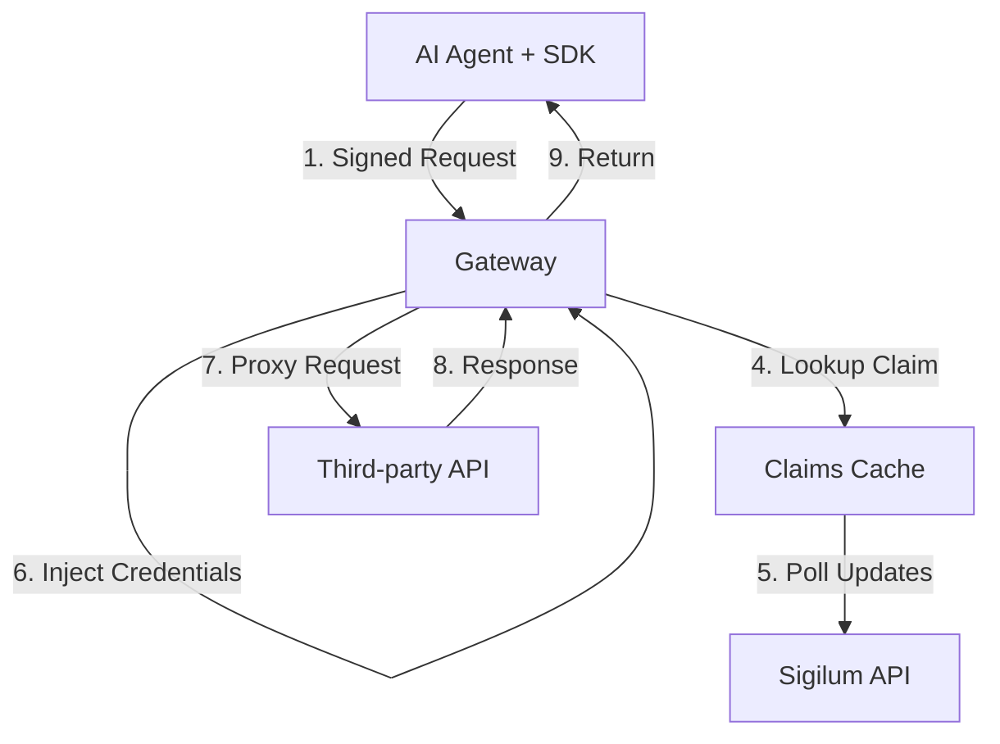

The Sigilum Gateway is a local reverse-proxy service that enforces Sigilum signed-auth and approved-claim checks before forwarding requests to third-party APIs with connector-managed credentials.

## Architecture Role

The Gateway serves as the **data plane** in Sigilum's architecture:

- **Gateway (Data Plane)**: Enforces approved claims, injects credentials, proxies requests
- **API (Control Plane)**: Manages authorization state and identity
- **SDK Layer**: Signs requests and verifies authorization



## Core Features

### Request Signature Verification

Verifies RFC 9421 signed requests:

- `signature-input` and `signature` headers
- `sigilum-namespace`, `sigilum-subject`, `sigilum-agent-key`, `sigilum-agent-cert`
- Content digest validation for request bodies
- Ed25519 signature algorithm

### Nonce Replay Protection

- In-memory nonce tracking per namespace
- 5-minute replay window
- Returns `AUTH_REPLAY_DETECTED` for duplicate nonces

### Approved Claims Enforcement

- Queries Sigilum API approved claims feed (`/v1/namespaces/claims`)
- Local cache with configurable TTL and refresh interval
- Validates `<namespace, public_key, service>` tuple
- Auto-submits authorization requests for unapproved agents (rate-limited)

### Connector Credential Management

- Encrypted local storage (BadgerDB)
- Multiple auth modes: Bearer, custom header, query parameter
- Shared credential variables with `{{KEY}}` references
- Credential rotation tracking with grace periods
- Strips Sigilum signing headers before upstream forwarding

### MCP Protocol Support

Native support for Model Context Protocol:

- Protocol: `mcp` (vs `http` for standard REST APIs)
- Streamable HTTP transport
- Tool discovery with caching (TTL + stale-if-error)
- Subject-level tool filtering policies
- Circuit breaker for upstream failures
- Bounded retry behavior for transient errors

### Error Handling

Structured error envelope for all failures:

```json
{
  "error": "Agent not authorized for this service",
  "code": "AUTH_CLAIM_REQUIRED",
  "request_id": "req_abc123",
  "timestamp": "2025-03-04T10:15:30Z",
  "docs_url": "https://docs.sigilum.id/errors/auth-claim-required"
}
```

## Deployment

The Gateway is built in **Go** and designed for local, single-instance operation.

### System Requirements

- Go 1.21+
- BadgerDB for local storage
- Network access to Sigilum API
- Optional: Envoy for local ingress

### Installation

```bash
# Build gateway binary
go build -o bin/sigilum-gateway ./apps/gateway/service/cmd/sigilum-gateway

# Run gateway
./bin/sigilum-gateway
```

Or use the CLI:

```bash
sigilum gateway start \
  --namespace johndee \
  --home ~/.sigilum-workspace \
  --api-url https://api.sigilum.id \
  --addr :38100
```

### Docker Compose

```bash
# Start gateway with Envoy ingress
docker compose -f apps/gateway/docker-compose.yml up --build
```

### Local-Only Design

The gateway is **not production-ready** for multi-instance deployments:

- Nonce replay protection is process-local (resets on restart)
- Connector secrets stored in local BadgerDB
- No distributed lock/state coordination
- No HA or multi-node consistency guarantees
- Admin routes are for trusted local environments

## API Surface

Canonical schema: `apps/gateway/openapi.yaml`

### Health Endpoints

```bash
GET /health        # Health check
GET /health/live   # Liveness probe
GET /health/ready  # Readiness probe
GET /metrics       # Prometheus metrics
```

### Proxy Endpoints (Runtime)

```bash
# HTTP protocol connections
ALL /proxy/{connection_id}/{path}

# Slack alias (fixed to connection_id=slack-proxy)
ALL /slack/{path}

# MCP protocol connections
GET  /mcp/{connection_id}/tools
GET  /mcp/{connection_id}/tools/{tool}/explain
POST /mcp/{connection_id}/tools/{tool}/call
```

All runtime endpoints require Sigilum signed headers.

### Admin Endpoints

<Accordion title="Connection Management">

```bash
# List connections
GET /api/admin/connections

# Create connection
POST /api/admin/connections

# Get connection details
GET /api/admin/connections/{id}

# Update connection
PATCH /api/admin/connections/{id}

# Delete connection
DELETE /api/admin/connections/{id}

# Test connection
POST /api/admin/connections/{id}/test

# Run MCP discovery
POST /api/admin/connections/{id}/discover?refresh=force

# Rotate credentials
POST /api/admin/connections/{id}/rotate
```

</Accordion>

<Accordion title="Credential Variables">

```bash
# List shared variables
GET /api/admin/credential-variables

# Create/update shared variable
POST /api/admin/credential-variables

# Delete shared variable
DELETE /api/admin/credential-variables/{key}
```

</Accordion>

<Accordion title="Service Catalog">

```bash
# Get service catalog
GET /api/admin/service-catalog

# Update service catalog
PUT /api/admin/service-catalog
```

</Accordion>

## Configuration

The Gateway uses environment variables for configuration.

### Core Configuration

<Accordion title="Core Environment Variables">

```bash
# Sigilum API endpoint
SIGILUM_REGISTRY_URL=https://api.sigilum.id

# Gateway signer identity
GATEWAY_SIGILUM_NAMESPACE=gateway
GATEWAY_SIGILUM_HOME=/var/lib/sigilum-gateway/.sigilum

# Service API key for claims feed
SIGILUM_SERVICE_API_KEY=sig_live_abc123...

# Per-connection API key overrides (optional)
SIGILUM_SERVICE_API_KEY_LINEAR_PROXY=sig_live_xyz789...
SIGILUM_SERVICE_API_KEY_SLACK_PROXY=sig_live_def456...

# Local encryption key (generate with: openssl rand -base64 32)
GATEWAY_MASTER_KEY=<base64_key>

# Listen address
GATEWAY_ADDR=:38100

# Local data directory
GATEWAY_DATA_DIR=/var/lib/sigilum-gateway

# Service catalog file
GATEWAY_SERVICE_CATALOG_FILE=/var/lib/sigilum-gateway/service-catalog.json
```

</Accordion>

### Claims Cache

<Accordion title="Claims Cache Configuration">

```bash
# Claims cache TTL (seconds)
GATEWAY_CLAIMS_CACHE_TTL_SECONDS=30

# Background refresh interval (seconds)
GATEWAY_CLAIMS_CACHE_REFRESH_SECONDS=10
```

The gateway polls the API approved claims feed every `REFRESH_SECONDS` and considers cached claims fresh for `TTL_SECONDS`.

</Accordion>

### MCP Configuration

<Accordion title="MCP Environment Variables">

```bash
# Discovery cache TTL (seconds)
GATEWAY_MCP_DISCOVERY_CACHE_TTL_SECONDS=300

# Stale-if-error fallback window (seconds)
GATEWAY_MCP_DISCOVERY_STALE_IF_ERROR_SECONDS=3600

# MCP runtime timeout (seconds)
GATEWAY_MCP_TIMEOUT_SECONDS=90

# Circuit breaker: consecutive failures before opening
GATEWAY_MCP_CIRCUIT_BREAKER_FAILURES=3

# Circuit breaker: cooldown after opening (seconds)
GATEWAY_MCP_CIRCUIT_BREAKER_COOLDOWN_SECONDS=10

# Tool call rate limit per connection+namespace (per minute)
GATEWAY_MCP_TOOL_CALL_RATE_LIMIT_PER_MINUTE=120
```

</Accordion>

### Rate Limiting

<Accordion title="Rate Limit Configuration">

```bash
# Claim registration rate limit per connection+namespace (per minute)
GATEWAY_CLAIM_REGISTRATION_RATE_LIMIT_PER_MINUTE=30

# MCP tool call rate limit per connection+namespace (per minute)
GATEWAY_MCP_TOOL_CALL_RATE_LIMIT_PER_MINUTE=120
```

Rate limits are applied per `connection_id + namespace` pair.

</Accordion>

### Timeouts

<Accordion title="Timeout Configuration">

```bash
# Admin/metrics handler timeout (seconds)
GATEWAY_ADMIN_TIMEOUT_SECONDS=20

# Proxy runtime handler timeout (seconds)
GATEWAY_PROXY_TIMEOUT_SECONDS=120

# MCP runtime handler timeout (seconds)
GATEWAY_MCP_TIMEOUT_SECONDS=90
```

</Accordion>

### Admin Access Control

<Accordion title="Admin Access Configuration">

```bash
# Admin access mode: hybrid (default), loopback, or token
GATEWAY_ADMIN_ACCESS_MODE=hybrid

# Admin token (required in token/hybrid mode)
GATEWAY_ADMIN_TOKEN=<strong_random_token>

# Require signed admin test/discover calls
GATEWAY_REQUIRE_SIGNED_ADMIN_CHECKS=true

# Browser origins allowed for CORS (comma-separated)
GATEWAY_ALLOWED_ORIGINS=http://localhost:38000,http://127.0.0.1:38000,https://sigilum.id

# Trusted proxy CIDRs for X-Forwarded-* headers (comma-separated)
GATEWAY_TRUSTED_PROXY_CIDRS=127.0.0.1/32,::1/128,172.16.0.0/12
```

**Admin Access Modes:**

- `hybrid`: Allow loopback OR valid admin token (default)
- `loopback`: Allow loopback only (most secure for local dev)
- `token`: Require admin token (for remote access)

</Accordion>

### Credential Rotation

<Accordion title="Rotation Configuration">

```bash
# Rotation enforcement: off, warn, or block
GATEWAY_ROTATION_ENFORCEMENT=warn

# Grace period in days
GATEWAY_ROTATION_GRACE_DAYS=0
```

In `block` mode, overdue connections return `ROTATION_REQUIRED` error.

</Accordion>

### Logging

<Accordion title="Logging Configuration">

```bash
# Enable structured decision logs
GATEWAY_LOG_PROXY_REQUESTS=true
```

When enabled, gateway emits JSON decision logs for:
- Auth decisions (signature, nonce, claim)
- Admin access decisions
- Runtime requests
- Upstream decisions

Redaction rules:
- Secret-bearing fields replaced with `[redacted]`
- Identity fields hashed to stable fingerprints
- Client IPs masked (`/24` for IPv4, `/64` for IPv6)

</Accordion>

### Development Bypass (Unsafe)

<Accordion title="Development Bypass Configuration">

```bash
# WARNING: Development only - skip signature verification
GATEWAY_ALLOW_UNSIGNED_PROXY=false
GATEWAY_ALLOW_UNSIGNED_CONNECTIONS=
```

**Never enable in production.**

</Accordion>

## Request Flow

### HTTP Protocol (Standard REST APIs)

```bash
# 1. Agent sends signed request
curl -X POST http://127.0.0.1:38100/proxy/linear-proxy/graphql \
  -H "Signature-Input: sig1=(...)" \
  -H "Signature: sig1=:...::" \
  -H "Sigilum-Namespace: johndee" \
  -H "Sigilum-Subject: user-42" \
  -H "Sigilum-Agent-Key: z6Mk..." \
  -H "Sigilum-Agent-Cert: eyJ0eXAi..." \
  -H "Content-Type: application/json" \
  -d '{"query":"{ issues { nodes { title } } }"}'

# 2. Gateway verifies signature
# 3. Gateway checks nonce (no replay)
# 4. Gateway validates approved claim
# 5. Gateway injects Linear API token
# 6. Gateway forwards to https://api.linear.app/graphql
# 7. Gateway returns upstream response
```

### MCP Protocol

```bash
# 1. Run discovery
curl -X POST http://127.0.0.1:38100/api/admin/connections/linear-mcp/discover?refresh=force

# 2. List available tools
curl http://127.0.0.1:38100/mcp/linear-mcp/tools \
  -H "Signature-Input: ..." \
  -H "Signature: ..." \
  -H "Sigilum-Namespace: johndee" \
  -H "Sigilum-Subject: user-42" \
  # ... other signed headers

# 3. Call a tool
curl -X POST http://127.0.0.1:38100/mcp/linear-mcp/tools/linear.searchIssues/call \
  -H "Signature-Input: ..." \
  # ... signed headers
  -d '{"query":"bug","limit":10}'
```

MCP discovery caching:
- `refresh=auto` (default): Use cache if fresh or stale-if-error
- `refresh=force`: Bypass cache and refresh discovery

## Connection Types

### HTTP Connections

```json
{
  "id": "linear-proxy",
  "name": "Linear",
  "protocol": "http",
  "base_url": "https://api.linear.app",
  "auth_mode": "bearer",
  "auth_prefix": "Bearer ",
  "auth_secret_key": "api_key",
  "secrets": {
    "api_key": "lin_api_abc123..."
  },
  "status": "active"
}
```

**Auth Modes:**

- `bearer`: Inject `Authorization: Bearer <token>` header
- `header_key`: Custom header name + value
- `query_param`: Add `?KEY=VALUE` query parameter

### MCP Connections

```json
{
  "id": "linear-mcp",
  "name": "Linear MCP",
  "protocol": "mcp",
  "base_url": "https://mcp.linear.app",
  "mcp_endpoint": "/mcp",
  "mcp_transport": "http",
  "auth_mode": "bearer",
  "auth_secret_key": "api_key",
  "secrets": {
    "api_key": "lin_api_xyz789..."
  },
  "mcp_tool_allowlist": ["linear.searchIssues", "linear.getIssue"],
  "mcp_tool_denylist": ["linear.deleteIssue"],
  "mcp_subject_tool_policies": {
    "user-readonly": {
      "allow": ["linear.searchIssues", "linear.getIssue"],
      "deny": ["linear.createIssue", "linear.updateIssue"]
    }
  },
  "status": "active"
}
```

**MCP Tool Filtering:**

1. Connection-level `mcp_tool_allowlist` (if set)
2. Connection-level `mcp_tool_denylist` (if set)
3. Subject-level policy (if `sigilum-subject` matches a policy key)
4. Default: Allow all discovered tools

### Shared Credential Variables

```bash
# Create shared variable
curl -X POST http://127.0.0.1:38100/api/admin/credential-variables \
  -H "Content-Type: application/json" \
  -H "Sigilum-Subject: user-admin" \
  -d '{"key":"OPENAI_API_KEY","value":"sk-live-abc123..."}'

# Reference in multiple connections
{
  "secrets": {
    "api_key": "{{OPENAI_API_KEY}}"
  }
}
```

Shared variables include `created_by_subject` for audit traceability.

## CLI Tools

The gateway includes a local CLI for direct connection management:

```bash
# List connections
go run ./apps/gateway/service/cmd/sigilum-gateway-cli list

# Add HTTP connection
go run ./apps/gateway/service/cmd/sigilum-gateway-cli add \
  --name Slack \
  --base-url https://slack.com/api \
  --auth-mode bearer \
  --auth-prefix "Bearer " \
  --auth-secret-key bot_token \
  --secret bot_token=xoxb-...

# Add MCP connection
go run ./apps/gateway/service/cmd/sigilum-gateway-cli add \
  --name LinearMCP \
  --protocol mcp \
  --base-url https://mcp.linear.app \
  --mcp-endpoint /mcp \
  --auth-secret-key api_key \
  --secret api_key=lin_api_... \
  --mcp-allow linear.searchIssues \
  --mcp-deny linear.createIssue

# Test connection
go run ./apps/gateway/service/cmd/sigilum-gateway-cli test \
  --id slack-proxy \
  --method GET \
  --path /auth.test

# Rotate credentials
go run ./apps/gateway/service/cmd/sigilum-gateway-cli rotate \
  --id slack-proxy \
  --secret bot_token=xoxb-new-token

# Delete connection
go run ./apps/gateway/service/cmd/sigilum-gateway-cli delete \
  --id slack-proxy
```

CLI reads:
- `GATEWAY_DATA_DIR` (default: `$XDG_DATA_HOME/sigilum-gateway`)
- `GATEWAY_MASTER_KEY` (required; can be passed via `--master-key`)

## Auth Failure Codes

The gateway returns deterministic auth failure codes:

| Code | Description |
|------|-------------|
| `AUTH_HEADERS_INVALID` | Duplicate or malformed signed headers |
| `AUTH_SIGNATURE_INVALID` | RFC 9421 signature verification failed |
| `AUTH_SIGNED_COMPONENTS_INVALID` | Signed component list doesn't match required profile |
| `AUTH_IDENTITY_INVALID` | Missing or invalid Sigilum identity headers |
| `AUTH_NONCE_INVALID` | Signature nonce missing or malformed |
| `AUTH_REPLAY_DETECTED` | Nonce already seen within replay window |
| `AUTH_CLAIMS_UNAVAILABLE` | Gateway claim cache is unavailable |
| `AUTH_CLAIMS_LOOKUP_FAILED` | Claim cache lookup failed |
| `AUTH_CLAIM_REQUIRED` | Caller not approved for requested service |
| `AUTH_CLAIM_SUBMIT_RATE_LIMITED` | Auto-claim registration rate-limited |
| `AUTH_FORBIDDEN` | Generic auth denial |
| `ROTATION_REQUIRED` | Connection credentials are overdue for rotation |

## Metrics

Prometheus-style metrics at `GET /metrics`:

```promql
# Auth rejections
sigilum_gateway_auth_reject_total{reason="signature_invalid"}

# Replay detections
sigilum_gateway_replay_detected_total

# Upstream requests
sigilum_gateway_upstream_requests_total{protocol="http",outcome="success"}

# Upstream latency
sigilum_gateway_upstream_latency_seconds_count{protocol="mcp",outcome="error"}

# MCP operations
sigilum_gateway_mcp_discovery_total{result="success"}
sigilum_gateway_mcp_tool_call_total{result="filtered"}

# In-flight requests
sigilum_gateway_requests_in_flight

# Graceful shutdown
sigilum_gateway_shutdown_drain_total{outcome="success"}
sigilum_gateway_shutdown_drain_seconds_sum{outcome="timeout"}
```

## Dashboard Pairing

For managed/enterprise deployments, use gateway pairing to connect local gateway to hosted dashboard:

```bash
sigilum gateway pair \
  --session-id <id> \
  --pair-code <code> \
  --namespace johndee
```

Pairing establishes an outbound WebSocket connection from gateway to API, allowing dashboard to:
- List/create/update/delete connections
- Test connections
- Run MCP discovery
- Rotate credentials

Secrets are encrypted to gateway public key before relay.

### Pairing Modes

```bash
# Foreground mode (keep terminal open)
sigilum gateway pair --session-id <id> --pair-code <code> --namespace johndee

# Daemon mode (background process)
sigilum gateway pair --daemon --session-id <id> --pair-code <code> --namespace johndee

# Check daemon status
sigilum gateway pair --status

# Stop daemon
sigilum gateway pair --stop
```

## Related Documentation

- [API](/components/api) - Control plane
- [CLI](/components/cli) - Local development tools
- [SDK Reference](/sdks/typescript) - Client libraries
- [Error Codes](/api-reference/gateway-errors) - Gateway error taxonomy
