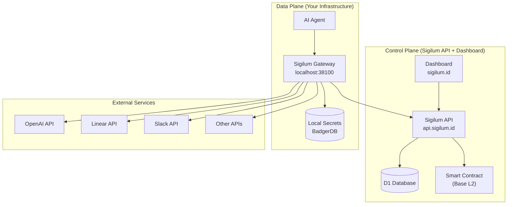
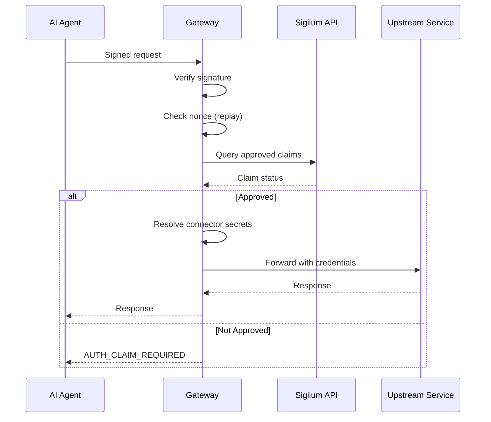

Sigilum uses a clear separation between **control plane** and **data plane** to provide secure, auditable AI agent identity while keeping sensitive credentials under your control.

## Architecture Overview

Sigilum's architecture separates concerns between identity management and request enforcement:



## Control Plane

The control plane manages identity, authorization state, approvals, and notifications. It consists of:

### Sigilum API

The API (`@sigilum/api`) is the backend for namespace-based agent authorization. It provides:

- **Namespace identity** - Manages `did:sigilum:<namespace>` DIDs
- **Service registration** - Authenticated service registration and API key management
- **Authorization lifecycle** - Handles the full lifecycle: `submit → approve/reject → revoke`
- **Verification endpoints** - SDK/runtime checks via `/v1/verify` and `/v1/namespaces/claims`
- **Dashboard authentication** - WebAuthn + JWT based auth
- **Webhook delivery** - Durable webhook delivery for authorization events
- **Blockchain audit logs** - Optional blockchain writes for immutable audit trail

**Key Endpoints:**

| Category | Endpoints |
|----------|----------|
| Health | `GET /health` |
| Auth | `/v1/auth/*` (signup, login, passkeys) |
| Namespaces | `GET /v1/namespaces/{namespace}`<br/>`GET /v1/namespaces/claims` |
| DID Resolution | `GET /.well-known/did/{did}`<br/>`GET /1.0/identifiers/{did}` |
| Verification | `GET /v1/verify` |
| Claims | `POST /v1/claims`<br/>`POST /v1/claims/{claimId}/approve`<br/>`POST /v1/claims/{claimId}/revoke` |
| Services | `/v1/services/*` (CRUD, keys, webhooks) |

**Runtime:**
- Framework: Hono
- Adapter architecture with default Cloudflare provider
- Bindings: D1 database, Durable Objects for nonce storage, Queues for blockchain/webhook delivery

<Info>
  All protected endpoints (`/v1/*` and `/.well-known/*`) require valid Sigilum signed headers using the RFC 9421 profile.
</Info>

### Dashboard

The dashboard (`sigilum.id`) provides:

- Namespace registration and management
- Provider connection configuration
- Authorization request approval/rejection interface
- Gateway pairing workflow
- WebAuthn-based authentication

### Smart Contract Registry

The `SigilumRegistry` contract (deployed on Base L2) provides:

- Immutable audit log of authorization state changes
- Namespace ownership records
- Claim approval/revocation events
- On-chain verification capabilities

**Core Methods:**
- `registerNamespace(name)`
- `transferNamespace(name, newOwner)`
- `submitClaim(namespace, publicKey, service, agentIP)`
- `approveClaim(claimId)` / `rejectClaim(claimId)`
- `revokeClaim(claimId)`
- `approveClaimDirect(...)` / `revokeClaimDirect(...)`
- `isAuthorized(namespace, publicKey, service)`

## Data Plane

The data plane enforces request signing, approved-claim checks, and proxies requests to upstream providers. **Provider secrets stay in your gateway.**

### Sigilum Gateway

The gateway is a local reverse-proxy service (written in Go) that runs where your agent runs. It enforces Sigilum authentication before forwarding requests to third-party APIs.

**What the Gateway Does:**

1. **Signature Verification** - Verifies RFC 9421 request signatures with required headers:
   - `signature-input` / `signature`
   - `sigilum-namespace`
   - `sigilum-subject`
   - `sigilum-agent-key`
   - `sigilum-agent-cert`

2. **Nonce Replay Protection** - Checks nonces in gateway process memory to prevent replay attacks

3. **Authorization Enforcement** - Confirms authorization by querying the approved claims feed from Sigilum API

4. **Request Proxying** - Routes to configured upstream connectors at `/proxy/{connection_id}/...`

5. **Credential Injection** - Injects connector auth headers (Bearer tokens, custom headers) and strips Sigilum signing headers

6. **MCP Support** - Supports Model Context Protocol connections with tool discovery and filtering

7. **Rate Limiting** - Applies per-connection+namespace rate limits for claim registration and tool calls

**Gateway Service Structure:**

```
apps/gateway/service/
├── cmd/sigilum-gateway          # Service entrypoint
├── cmd/sigilum-gateway-cli      # Local CLI
├── config/                      # Environment loading
├── internal/connectors/         # Connector models, auth injection
├── internal/mcp/                # MCP client and policy
├── internal/claims/             # Claims authorization lookup
└── internal/catalog/            # Service catalog persistence
```

**Request Flow:**



**Key Features:**

- **Local-only deployment** - Runs on the same machine as your agent
- **Encrypted secret storage** - Uses BadgerDB with master key encryption
- **Protocol support** - HTTP and MCP (Model Context Protocol) connectors
- **Subject-level policies** - MCP tool filtering by `sigilum-subject`
- **Shared credentials** - Reusable credential variables across connections
- **Error taxonomy** - Deterministic auth failure codes for client handling

<Warning>
  The gateway is designed for local, single-instance operation. Nonce replay protection is process-local and in-memory. For production multi-instance deployments, additional coordination would be required.
</Warning>

## Component Communication

### Gateway to API

The gateway queries the API for approved claims using:

- `GET /v1/namespaces/claims` - Approved claims cache feed
- Service API key authentication
- Periodic refresh to stay synchronized

### API to Blockchain

Depending on `BLOCKCHAIN_MODE` configuration:

- `disabled` - Skip blockchain writes
- `sync` - Execute inline (synchronous)
- `memory` - In-memory async queue (testing)
- `queue` - Durable queue-backed writes (production)

Blockchain writes provide an immutable audit log but are optional.

### API to Services (Webhooks)

Services can register webhooks to receive authorization lifecycle events:

- `request.submitted`
- `request.approved`
- `request.rejected`
- `request.revoked`

Webhook delivery is durable with exponential backoff retry and terminal failure alerts.

## Data Storage

### Control Plane Storage

| Store | Contents |
|-------|----------|
| D1 Database | Users, namespaces, services, API keys, claims, webhooks |
| Durable Objects | Nonce replay protection store |
| Blockchain | Immutable audit log (optional) |

### Data Plane Storage

| Store | Contents |
|-------|----------|
| BadgerDB | Encrypted connection configurations and secrets |
| Process Memory | Nonce replay cache, claims authorization cache |
| File System | Service catalog templates, MCP discovery metadata |

## Security Boundaries

### What Stays in Control Plane

- User accounts and authentication state
- Namespace ownership records
- Service registrations and API keys
- Authorization approval/revocation state
- Webhook configurations
- Audit logs

### What Stays in Data Plane

- **Provider credentials** (API keys, tokens) - **NEVER** sent to control plane
- Connection configurations
- MCP tool discovery cache
- Request signatures and nonces
- Local encryption keys

<Note>
  This separation ensures that even if the control plane is compromised, provider credentials remain secure in your local gateway.
</Note>

## Observability

### Logs

When `GATEWAY_LOG_PROXY_REQUESTS=true`, the gateway emits structured JSON decision logs with:

- Auth decision points
- Claim lookup results
- Upstream request outcomes
- Automatic PII redaction (secrets, tokens, hashed identities)

### Metrics

Gateway exposes Prometheus-style metrics at `GET /metrics`:

```
sigilum_gateway_auth_reject_total{reason=...}
sigilum_gateway_replay_detected_total
sigilum_gateway_upstream_requests_total{protocol=...,outcome=...}
sigilum_gateway_upstream_latency_seconds_{count,sum}
sigilum_gateway_mcp_discovery_total{result=...}
sigilum_gateway_mcp_tool_call_total{result=...}
sigilum_gateway_requests_in_flight
```

## Next Steps

<CardGroup cols={2}>
  <Card title="Identity Model" icon="fingerprint" href="/concepts/identity-model">
    Learn about DID-based identity and certification
  </Card>
  <Card title="Authorization Flow" icon="shield-check" href="/concepts/authorization-flow">
    Understand how authorization requests work
  </Card>
  <Card title="Deployment Modes" icon="server" href="/concepts/deployment-modes">
    Choose the right deployment for your needs
  </Card>
  <Card title="API Reference" icon="code" href="/api-reference/overview">
    Explore API endpoints and specifications
  </Card>
</CardGroup>