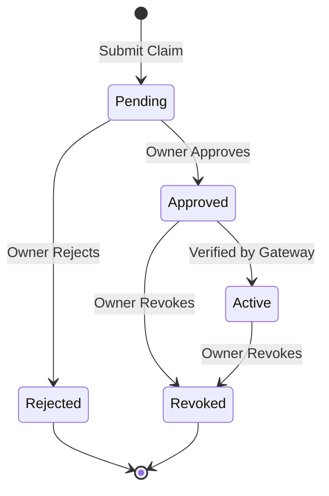
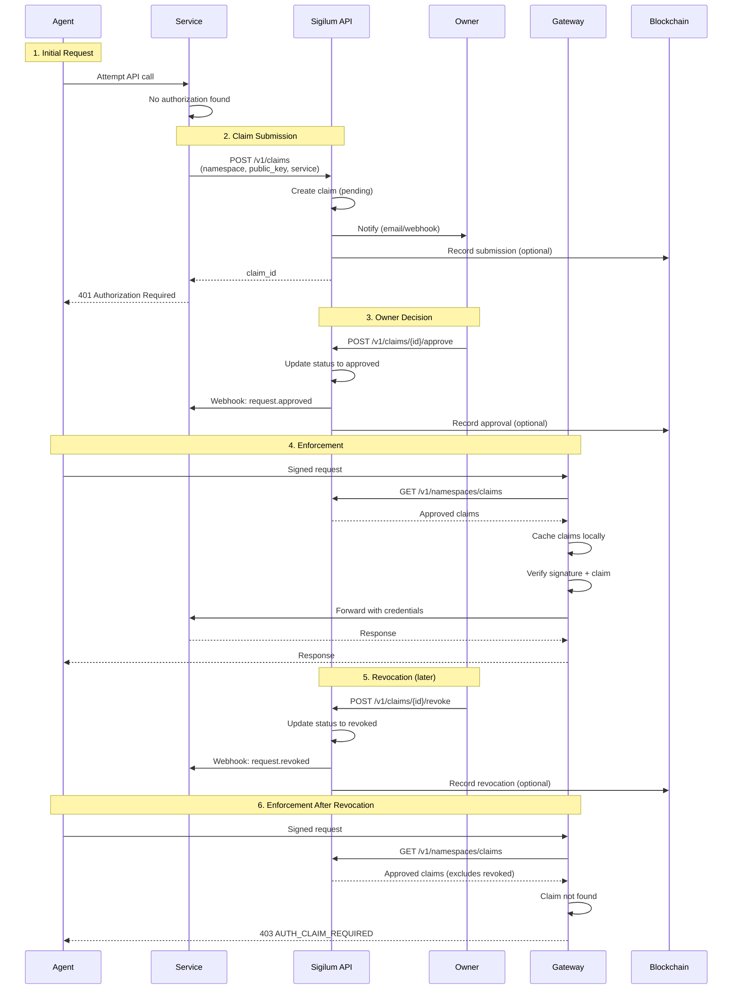

Sigilum's authorization flow manages the complete lifecycle of agent access requests, from initial submission through approval, enforcement, and eventual revocation.

## Overview

The authorization flow follows a multi-stage lifecycle:



## Claim Lifecycle States

### 1. Pending

Initial state when a service submits an authorization request.

**Characteristics:**
- Awaiting namespace owner decision
- Not yet enforceable
- Notifications sent to owner
- Can be approved or rejected

### 2. Approved

Owner has granted authorization.

**Characteristics:**
- Enforceable by gateway
- Included in approved claims feed
- Can be revoked at any time
- Optionally written to blockchain

### 3. Rejected

Owner has denied authorization (terminal state).

**Characteristics:**
- Not enforceable
- Cannot be approved without resubmission
- Service receives rejection notification

### 4. Revoked

Previously approved authorization has been revoked (terminal state).

**Characteristics:**
- No longer enforceable
- Removed from approved claims feed
- Service receives revocation notification
- Gateway immediately blocks requests

## Complete Authorization Flow

### End-to-End Sequence



## Detailed Steps

### Step 1: Claim Submission

Services submit authorization requests on behalf of agents.

**API Call:**

```bash
POST /v1/claims
Authorization: Bearer <service-api-key>
Content-Type: application/json
```

**Request Body:**

```json
{
  "namespace": "my-namespace",
  "public_key": "z6Mkf5rGeLtXy9h8W3pq7nNxKJCxvZMQRj4tU8sVwXyN9kDp",
  "service": "openai",
  "agent_ip": "192.168.1.100",
  "metadata": {
    "agent_name": "Task Assistant",
    "requested_by": "user-123"
  }
}
```

**Authentication:**

<Note>
  The service API key is obtained when registering a service via `POST /v1/services`. The request must also include valid Sigilum signed headers.
</Note>

**Response:**

```json
{
  "claim_id": "claim_abc123xyz",
  "status": "pending",
  "submitted_at": "2024-01-15T10:30:00Z"
}
```

**What Happens:**

1. API validates service API key and signed headers
2. Checks for duplicate claims (same namespace + public_key + service)
3. Creates claim record in `pending` state
4. Sends notification to namespace owner
5. Optionally writes to blockchain queue
6. Returns claim ID to service

**Rate Limiting:**

Claim submission is rate limited per `connection_id + namespace`:

- Default: 30 requests per minute
- Configurable: `GATEWAY_CLAIM_REGISTRATION_RATE_LIMIT_PER_MINUTE`
- Rejection: `AUTH_CLAIM_SUBMIT_RATE_LIMITED`

### Step 2: Owner Notification

The namespace owner receives notification through:

- **Dashboard** - Real-time notification in UI
- **Email** - Email alert with approval link
- **Webhook** - Service webhook (if configured)

**Notification Payload:**

```json
{
  "event": "request.submitted",
  "claim_id": "claim_abc123xyz",
  "namespace": "my-namespace",
  "service": "openai",
  "public_key": "z6Mkf5rG...",
  "agent_ip": "192.168.1.100",
  "metadata": {
    "agent_name": "Task Assistant"
  },
  "submitted_at": "2024-01-15T10:30:00Z",
  "approval_url": "https://sigilum.id/claims/claim_abc123xyz"
}
```

### Step 3: Owner Decision

The namespace owner makes a decision via dashboard or API.

**Approval:**

```bash
POST /v1/claims/claim_abc123xyz/approve
Authorization: Bearer <owner-jwt>
```

Response:

```json
{
  "claim_id": "claim_abc123xyz",
  "status": "approved",
  "approved_at": "2024-01-15T10:35:00Z"
}
```

**Rejection:**

```bash
POST /v1/claims/claim_abc123xyz/reject
Authorization: Bearer <owner-jwt>
```

Response:

```json
{
  "claim_id": "claim_abc123xyz",
  "status": "rejected",
  "rejected_at": "2024-01-15T10:35:00Z"
}
```

**What Happens on Approval:**

1. API updates claim status to `approved`
2. Webhook sent to service: `request.approved`
3. Claim added to approved claims feed
4. Blockchain event recorded (if enabled)
5. Gateway begins enforcing authorization on next cache refresh

<Info>
  Approval is idempotent - approving an already approved claim is a no-op.
</Info>

### Step 4: Gateway Enforcement

The gateway enforces approved authorizations on every request.

**Approved Claims Feed Query:**

```bash
GET /v1/namespaces/claims
Authorization: Bearer <service-api-key>
```

Response:

```json
{
  "claims": [
    {
      "namespace": "my-namespace",
      "public_key": "z6Mkf5rG...",
      "service": "openai",
      "status": "approved",
      "approved_at": "2024-01-15T10:35:00Z",
      "claim_id": "claim_abc123xyz"
    }
  ],
  "updated_at": "2024-01-15T10:35:00Z"
}
```

**Gateway Cache Behavior:**

- Queries approved claims feed periodically (default: every 30 seconds)
- Caches claims in memory for fast lookup
- Validates claim exists for `(namespace, public_key, service)` triple
- Fails closed if cache is unavailable: `AUTH_CLAIMS_UNAVAILABLE`

**Request Validation Flow:**

1. **Extract Identity** - Parse `sigilum-namespace`, `sigilum-agent-key` from headers
2. **Verify Signature** - Validate RFC 9421 signature
3. **Check Nonce** - Ensure nonce hasn't been seen (replay protection)
4. **Lookup Claim** - Query local cache for approved claim
5. **Resolve Connector** - Load connection config and secrets
6. **Forward Request** - Inject auth and proxy to upstream

**Error Responses:**

If authorization fails, gateway returns structured errors:

```json
{
  "error": "Authorization claim required",
  "code": "AUTH_CLAIM_REQUIRED",
  "request_id": "req_xyz789",
  "timestamp": "2024-01-15T10:30:00Z",
  "docs_url": "https://docs.sigilum.id/errors/AUTH_CLAIM_REQUIRED"
}
```

**Gateway Error Codes:**

| Code | Meaning |
|------|--------|
| `AUTH_HEADERS_INVALID` | Duplicate or malformed signed headers |
| `AUTH_SIGNATURE_INVALID` | RFC 9421 signature verification failed |
| `AUTH_SIGNED_COMPONENTS_INVALID` | Missing required signed components |
| `AUTH_IDENTITY_INVALID` | Invalid Sigilum identity headers |
| `AUTH_NONCE_INVALID` | Nonce missing or malformed |
| `AUTH_REPLAY_DETECTED` | Nonce already seen (replay attack) |
| `AUTH_CLAIMS_UNAVAILABLE` | Claims cache unavailable |
| `AUTH_CLAIMS_LOOKUP_FAILED` | Claim cache lookup failed |
| `AUTH_CLAIM_REQUIRED` | No approved claim found |
| `AUTH_CLAIM_SUBMIT_RATE_LIMITED` | Claim submission rate limit hit |
| `AUTH_FORBIDDEN` | Generic authorization denial |

### Step 5: Revocation

Owners can revoke authorization at any time.

**API Call:**

```bash
POST /v1/claims/claim_abc123xyz/revoke
Authorization: Bearer <owner-jwt>
```

Response:

```json
{
  "claim_id": "claim_abc123xyz",
  "status": "revoked",
  "revoked_at": "2024-01-15T11:00:00Z"
}
```

**What Happens:**

1. API updates claim status to `revoked`
2. Webhook sent to service: `request.revoked`
3. Claim removed from approved claims feed
4. Blockchain event recorded (if enabled)
5. Gateway stops enforcing on next cache refresh (typically within 30 seconds)

<Warning>
  There is a propagation delay between revocation and enforcement. The gateway's cache refresh interval (default 30 seconds) determines how quickly revocations take effect.
</Warning>

**Alternative Revocation Methods:**

For immediate revocation without claim ID:

```solidity
// Smart contract direct revocation
revokeClaimDirect(namespace, publicKey, service)
```

## Verification Endpoint

Services can verify individual authorizations via the verification endpoint.

**API Call:**

```bash
GET /v1/verify?namespace=my-namespace&public_key=z6Mkf5rG...&service=openai
Authorization: Bearer <service-api-key>
```

Response (authorized):

```json
{
  "authorized": true,
  "namespace": "my-namespace",
  "public_key": "z6Mkf5rG...",
  "service": "openai",
  "status": "approved",
  "approved_at": "2024-01-15T10:35:00Z"
}
```

Response (not authorized):

```json
{
  "authorized": false,
  "namespace": "my-namespace",
  "public_key": "z6Mkf5rG...",
  "service": "openai"
}
```

**Use Cases:**

- Point verification for specific requests
- Pre-flight authorization checks
- Service-side validation before expensive operations

<Note>
  The approved claims feed (`GET /v1/namespaces/claims`) is more efficient for gateways that handle many requests, as it provides batch claim data for caching.
</Note>

## Webhook Delivery

Services can register webhooks to receive authorization lifecycle events.

### Webhook Configuration

```bash
POST /v1/services/{serviceId}/webhooks
Content-Type: application/json
```

```json
{
  "url": "https://api.example.com/sigilum/webhooks",
  "events": [
    "request.submitted",
    "request.approved",
    "request.rejected",
    "request.revoked"
  ],
  "secret": "whsec_abc123xyz"
}
```

### Webhook Events

**`request.submitted`** - New claim submitted:

```json
{
  "event": "request.submitted",
  "claim_id": "claim_abc123xyz",
  "namespace": "my-namespace",
  "service": "openai",
  "public_key": "z6Mkf5rG...",
  "submitted_at": "2024-01-15T10:30:00Z"
}
```

**`request.approved`** - Claim approved:

```json
{
  "event": "request.approved",
  "claim_id": "claim_abc123xyz",
  "namespace": "my-namespace",
  "service": "openai",
  "public_key": "z6Mkf5rG...",
  "approved_at": "2024-01-15T10:35:00Z"
}
```

**`request.rejected`** - Claim rejected:

```json
{
  "event": "request.rejected",
  "claim_id": "claim_abc123xyz",
  "namespace": "my-namespace",
  "service": "openai",
  "public_key": "z6Mkf5rG...",
  "rejected_at": "2024-01-15T10:35:00Z"
}
```

**`request.revoked`** - Claim revoked:

```json
{
  "event": "request.revoked",
  "claim_id": "claim_abc123xyz",
  "namespace": "my-namespace",
  "service": "openai",
  "public_key": "z6Mkf5rG...",
  "revoked_at": "2024-01-15T11:00:00Z"
}
```

### Webhook Reliability

Webhook delivery is durable with:

- **Exponential backoff** - Retry with increasing delays
- **Retry window** - Configurable via `WEBHOOK_RETRY_WINDOW_HOURS`
- **Signature verification** - HMAC signature with webhook secret
- **Terminal failure alerts** - Email notification on permanent failure

## Blockchain Integration

Sigilum optionally writes authorization events to the blockchain for immutable audit logs.

### Blockchain Modes

Configured via `BLOCKCHAIN_MODE`:

| Mode | Behavior | Use Case |
|------|----------|----------|
| `disabled` | Skip blockchain writes | Testing, cost optimization |
| `sync` | Execute inline (synchronous) | Immediate consistency required |
| `memory` | In-memory async queue | Local testing |
| `queue` | Durable queue-backed writes | Production (recommended) |

### Smart Contract Events

The `SigilumRegistry` contract emits events:

```solidity
event ClaimSubmitted(
    uint256 indexed claimId,
    string namespace,
    bytes32 publicKeyHash,
    string service,
    string agentIP
);

event ClaimApproved(
    uint256 indexed claimId,
    string namespace,
    bytes32 publicKeyHash,
    string service
);

event ClaimRevoked(
    uint256 indexed claimId,
    string namespace,
    bytes32 publicKeyHash,
    string service
);
```

**Query Authorization On-Chain:**

```solidity
bool authorized = registry.isAuthorized(namespace, publicKeyHash, service);
```

<Info>
  Blockchain writes provide an immutable audit log but add latency and cost. Use `queue` mode in production to decouple blockchain writes from API response time.
</Info>

## Auto-Registration (Gateway)

The gateway can automatically submit claims when an unauthorized request is received.

**Trigger:**

1. Agent makes signed request to gateway
2. Gateway verifies signature (valid)
3. Gateway checks approved claims (not found)
4. Gateway submits claim to API automatically
5. Gateway returns `AUTH_CLAIM_REQUIRED` to agent
6. Owner receives notification to approve

**Rate Limiting:**

Auto-registration is rate limited to prevent spam:

- Per `connection_id + namespace` pair
- Default: 30 requests per minute
- Configurable: `GATEWAY_CLAIM_REGISTRATION_RATE_LIMIT_PER_MINUTE`

## Security Considerations

### Nonce Replay Protection

<Warning>
  Nonces are checked in-memory by the gateway with a default 60-second window. The gateway must receive requests within this window to prevent replay attacks.
</Warning>

**Requirements:**

- Nonce must be unique per request
- Nonce must be fresh (within replay window)
- Nonce checked against in-memory cache
- Process-local only (not distributed)

### Signature Verification

All requests must have valid Ed25519 signatures covering:

- HTTP method
- Request path
- Identity headers
- Content digest (if body present)

### Certificate Validation

The `sigilum-agent-cert` header must:

- Be properly formatted and parseable
- Match the namespace in `sigilum-namespace`
- Match the public key in `sigilum-agent-key`
- Have valid signature
- Not be expired (if expiry set)

## Best Practices

<CardGroup cols={2}>
  <Card title="Webhook Signature Verification" icon="shield">
    Always verify webhook signatures using the webhook secret to prevent spoofing
  </Card>
  <Card title="Cache Approved Claims" icon="database">
    Use the claims feed endpoint to cache approved claims locally for performance
  </Card>
  <Card title="Handle Revocation Delay" icon="clock">
    Account for gateway cache refresh interval (30s default) when revoking
  </Card>
  <Card title="Monitor Rate Limits" icon="gauge">
    Monitor claim submission rate limits to avoid auto-registration failures
  </Card>
</CardGroup>

## Next Steps

<CardGroup cols={2}>
  <Card title="Deployment Modes" icon="server" href="/concepts/deployment-modes">
    Learn about managed, enterprise, and local deployment options
  </Card>
  <Card title="Gateway Configuration" icon="gear" href="/components/gateway">
    Configure gateway settings and rate limits
  </Card>
  <Card title="API Reference" icon="code" href="/api-reference/overview">
    Explore all API endpoints in detail
  </Card>
  <Card title="Gateway API" icon="gateway" href="/api-reference/gateway/overview">
    Learn about gateway error codes and handling
  </Card>
</CardGroup>