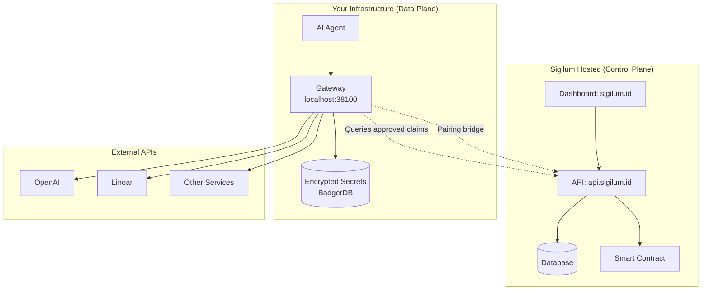
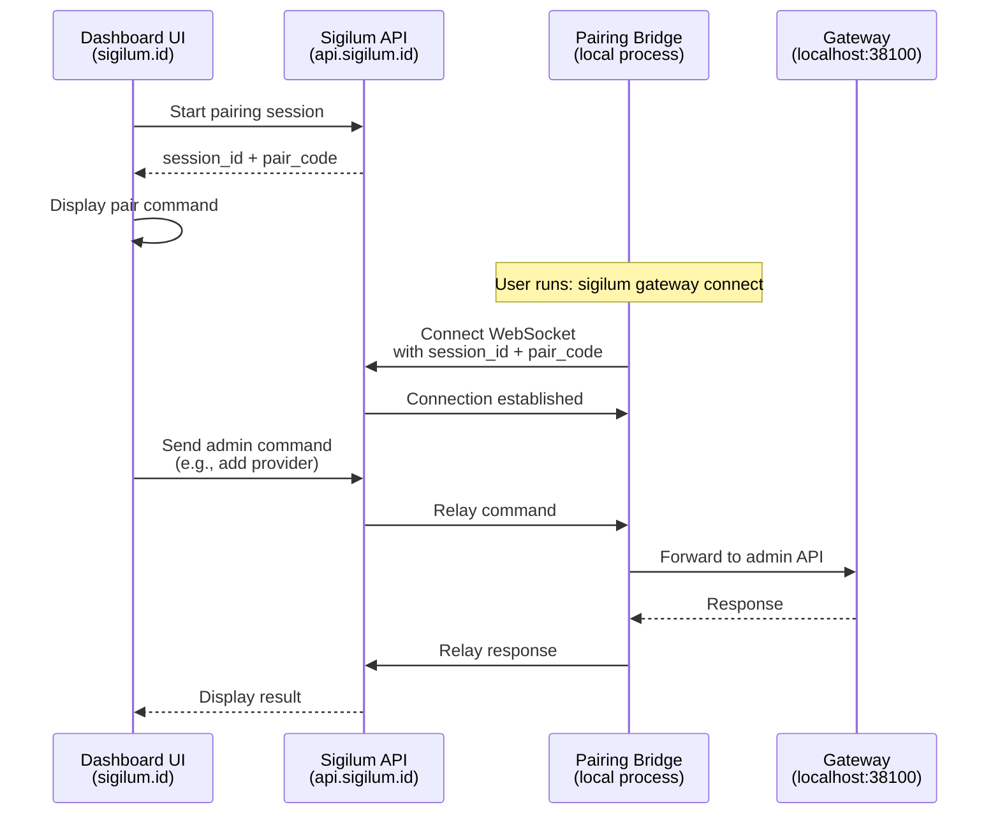
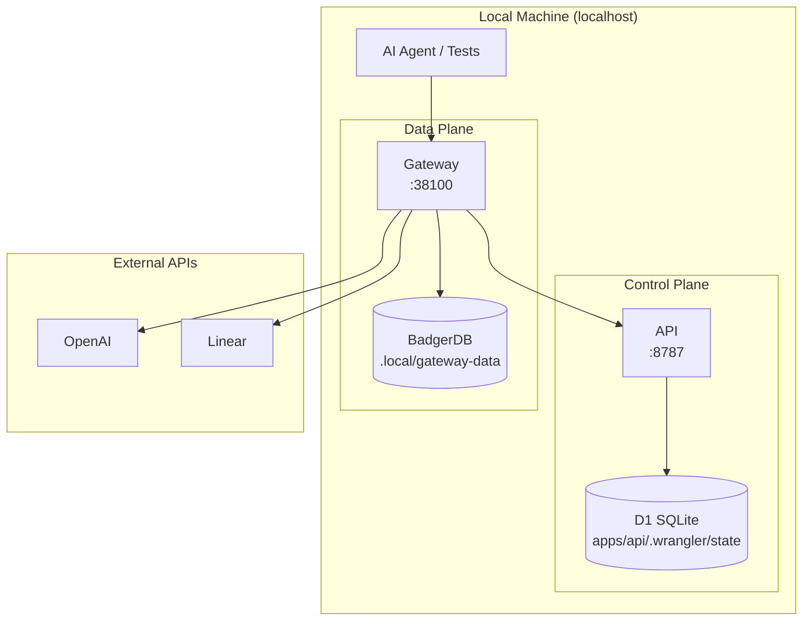
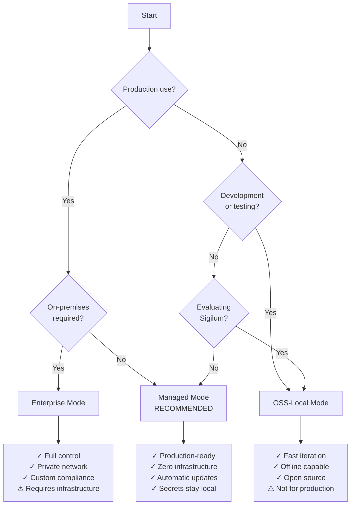

Sigilum supports three deployment modes to fit different operational and security requirements. Each mode offers different tradeoffs between convenience, control, and infrastructure management.

## Deployment Modes Comparison

| Mode | Control Plane | Gateway | Use Case | Provider Secrets |
|------|--------------|---------|----------|------------------|
| **Managed** | Hosted at [api.sigilum.id](https://api.sigilum.id) | Customer-side (local/VM/VPC) | **Recommended.** Production use with hosted control plane | Local in your gateway |
| **Enterprise** | Self-hosted (your infrastructure) | Self-hosted (your infrastructure) | Full on-prem or private network deployment | Local in your gateway |
| **OSS-Local** | Local (open-source API) | Local (same machine) | Development, testing, and evaluation | Local in your gateway |

<Info>
  In all deployment modes, **provider credentials remain local** in your gateway. The control plane never sees or stores your API keys, tokens, or secrets.
</Info>

## Managed Mode

**Recommended for production use.**

Managed mode uses Sigilum's hosted control plane while keeping the gateway (and your secrets) on your infrastructure.

### Architecture



### Characteristics

**Control Plane (Hosted by Sigilum):**
- User authentication and namespace management
- Authorization request approval workflow
- Service registration and API key management
- Webhook delivery and notifications
- Blockchain audit log writes
- DID resolution and verification endpoints

**Data Plane (Your Infrastructure):**
- Gateway runs on your VM, VPS, or local machine
- All provider credentials stored locally
- Request signature verification
- Approved claims cache
- Provider credential injection
- Request proxying to upstream APIs

### Setup

1. **Sign up and reserve namespace:**

   Visit [sigilum.id](https://sigilum.id) and create an account.

2. **Install CLI and start gateway:**

   ```bash
   curl -fsSL https://github.com/PaymanAI/sigilum/releases/latest/download/install-curl.sh | bash
   source ~/.zshrc
   sigilum gateway start --namespace your-namespace
   ```

3. **Connect gateway to dashboard:**

   In the dashboard, click **Start Pairing** and run:

   ```bash
   sigilum gateway connect \
     --session-id <session-id> \
     --pair-code <pair-code> \
     --namespace your-namespace \
     --api-url https://api.sigilum.id
   ```

4. **Add providers:**

   Use the dashboard to configure provider connections. Secrets are encrypted and stored locally.

5. **Configure agent:**

   Point your agent to `http://127.0.0.1:38100` for proxied requests.

### Gateway Pairing

Managed mode uses a **pairing bridge** to connect your local gateway to the hosted dashboard:



**Pairing Commands:**

```bash
# Check pairing status
sigilum gateway pair --status

# Stop pairing bridge
sigilum gateway pair --stop
```

<Note>
  The pairing bridge runs as a daemon process that maintains a persistent WebSocket connection to the API. It relays admin commands from the dashboard to your local gateway without exposing the gateway's admin API to the internet.
</Note>

### Benefits

<CardGroup cols={2}>
  <Card title="Zero Infrastructure" icon="cloud">
    No need to deploy, maintain, or scale the control plane
  </Card>
  <Card title="Automatic Updates" icon="arrows-rotate">
    Control plane updates and improvements without manual intervention
  </Card>
  <Card title="Managed Availability" icon="check-circle">
    SLA-backed uptime for control plane services
  </Card>
  <Card title="Secrets Stay Local" icon="lock">
    Provider credentials never leave your infrastructure
  </Card>
</CardGroup>

### When to Use

- **Production applications** - Proven, hosted control plane
- **Fast onboarding** - Get started in minutes
- **Focus on agent logic** - Let Sigilum handle infrastructure
- **SaaS/cloud deployments** - VPS, VM, or container-based agents

<Warning>
  The gateway must be able to make HTTPS requests to `api.sigilum.id`. Ensure your firewall allows outbound HTTPS (port 443) from the gateway.
</Warning>

## Enterprise Mode

**Full self-hosted deployment for on-premises or private networks.**

Enterprise mode runs both control plane and data plane on your infrastructure.

### Architecture

```mermaid
graph TB
    subgraph "Your Private Network"
        subgraph "Control Plane"
            API[Sigilum API<br/>your-api.internal]
            Dashboard[Dashboard<br/>your-dashboard.internal]
            DB[(Database)]
            Registry[Smart Contract<br/>(optional)]
        end
        
        subgraph "Data Plane"
            Gateway1[Gateway 1]
            Gateway2[Gateway 2]
            Agent1[Agent 1]
            Agent2[Agent 2]
        end
        
        Dashboard --> API
        API --> DB
        API -.-> Registry
        Gateway1 --> API
        Gateway2 --> API
        Agent1 --> Gateway1
        Agent2 --> Gateway2
    end
    
    subgraph "External APIs (via VPN/proxy)"
        OpenAI[OpenAI]
        Linear[Linear]
    end
    
    Gateway1 --> OpenAI
    Gateway2 --> Linear
```

### Characteristics

**Control Plane (Your Infrastructure):**
- Deploy Sigilum API (Cloudflare Workers or adapter-compatible runtime)
- Host dashboard (static site or behind reverse proxy)
- Manage database (D1, PostgreSQL, or compatible)
- Optional: Run blockchain node or use public network

**Data Plane (Your Infrastructure):**
- Deploy one or more gateways
- Configure network policies and firewalls
- Manage gateway secrets and encryption keys
- Control all data flows

### Setup

1. **Deploy control plane:**

   ```bash
   # Clone repository
   git clone https://github.com/PaymanAI/sigilum.git
   cd sigilum
   
   # Configure API
   cd apps/api
   cp .dev.vars.example .dev.vars
   # Edit .dev.vars with your configuration
   
   # Deploy to your infrastructure
   pnpm --filter @sigilum/api build
   pnpm --filter @sigilum/api deploy
   ```

2. **Deploy dashboard:**

   Build and deploy the dashboard to your static hosting or CDN.

3. **Configure gateway:**

   ```bash
   # Set API URL to your private control plane
   export SIGILUM_REGISTRY_URL="https://your-api.internal"
   export SIGILUM_SERVICE_API_KEY="<your-service-key>"
   export GATEWAY_MASTER_KEY="<your-master-key>"
   
   # Start gateway
   sigilum gateway start --namespace your-namespace
   ```

4. **Configure networking:**

   Ensure gateways can reach your control plane API:
   - Internal DNS or service discovery
   - VPN or private network connectivity
   - mTLS or VPC peering (optional)

### Required Infrastructure

| Component | Requirements |
|-----------|-------------|
| **API Runtime** | Cloudflare Workers, Node.js server, or adapter-compatible runtime |
| **Database** | D1, PostgreSQL, MySQL, or compatible SQL database |
| **Dashboard** | Static hosting (S3, Cloudflare Pages, Netlify) or web server |
| **Gateway** | VM, container, or bare metal with Go runtime |
| **Blockchain** (optional) | Ethereum-compatible node or public RPC endpoint |

### Benefits

<CardGroup cols={2}>
  <Card title="Complete Control" icon="shield">
    Full ownership of data, infrastructure, and deployment
  </Card>
  <Card title="Private Network" icon="lock">
    Keep all traffic within your network perimeter
  </Card>
  <Card title="Custom Policies" icon="gavel">
    Implement organization-specific compliance and security policies
  </Card>
  <Card title="Air-Gapped Option" icon="ban">
    Deploy without internet connectivity (blockchain optional)
  </Card>
</CardGroup>

### When to Use

- **Regulated industries** - Healthcare, finance, government
- **Data sovereignty** - Keep all data in specific regions/jurisdictions
- **Private networks** - Air-gapped or restricted network environments
- **Custom compliance** - Organization-specific audit or security requirements

<Note>
  Enterprise mode requires infrastructure expertise to deploy, maintain, and scale the control plane. Consider managed mode if infrastructure management is not a priority.
</Note>

## OSS-Local Mode

**Local development and testing with open-source components.**

OSS-Local mode runs the entire stack locally on a single machine.

### Architecture



### Characteristics

**All Components Local:**
- API runs on `http://127.0.0.1:8787` (Wrangler dev server)
- Gateway runs on `http://127.0.0.1:38100`
- SQLite database in `.wrangler/state/`
- BadgerDB secrets store in `.local/gateway-data/`
- No dashboard required (optional)

### Setup

1. **Clone and install:**

   ```bash
   git clone https://github.com/PaymanAI/sigilum.git
   cd sigilum
   corepack enable && corepack prepare pnpm@10.29.3 --activate
   pnpm install
   pnpm --dir sdks/sdk-ts build
   ```

2. **Start the local stack:**

   ```bash
   ./sigilum up
   ```

   This starts:
   - API on `http://127.0.0.1:8787`
   - Gateway on `http://127.0.0.1:38100`

3. **Verify health:**

   ```bash
   curl -sf http://127.0.0.1:8787/health
   curl -sf http://127.0.0.1:38100/health
   ```

4. **Register services:**

   ```bash
   export OPENAI_API_KEY="sk-..."
   ./sigilum service add \
     --service-slug openai \
     --service-name "OpenAI" \
     --mode gateway \
     --upstream-base-url https://api.openai.com \
     --auth-mode bearer \
     --upstream-secret-env OPENAI_API_KEY
   ```

5. **Run tests:**

   ```bash
   ./sigilum e2e-tests
   ```

### Local Data Paths

| Path | Contents |
|------|----------|
| `./.sigilum-workspace` | Workspace identities and bootstrap keys |
| `./.local/gateway-data` | Gateway BadgerDB data store |
| `./.local/bin` | Prebuilt gateway binaries |
| `./apps/api/.wrangler/state/` | API D1 SQLite database files |

### CLI Helpers

The `./sigilum` wrapper script provides local stack management:

```bash
./sigilum up                    # Start API + gateway
./sigilum down                  # Stop all services
./sigilum service add           # Register a service
./sigilum service list          # List services
./sigilum e2e-tests            # Run end-to-end tests
./sigilum doctor               # Check local stack health
./sigilum doctor --fix         # Auto-fix common issues
./sigilum auth refresh         # Issue local owner JWT
```

### Benefits

<CardGroup cols={2}>
  <Card title="Fast Iteration" icon="bolt">
    Immediate feedback loop for development and testing
  </Card>
  <Card title="No Cloud Dependencies" icon="laptop">
    Develop offline or without external services
  </Card>
  <Card title="Complete Transparency" icon="eye">
    Inspect all components, data, and flows locally
  </Card>
  <Card title="Open Source" icon="code-branch">
    Full access to all source code and implementation
  </Card>
</CardGroup>

### When to Use

- **Development** - Build and test agent integrations locally
- **Testing** - Automated tests, CI/CD pipelines
- **Evaluation** - Understand Sigilum architecture and behavior
- **Contribution** - Develop features or fixes for Sigilum
- **Learning** - Study the implementation and protocols

<Warning>
  OSS-Local mode is not intended for production use. The local API lacks durability, scalability, and security hardening required for production workloads.
</Warning>

### Low-Memory Environments

If running in constrained environments (e.g., 4GB Docker containers):

```bash
# Pre-build gateway binaries to reduce memory pressure
mkdir -p ./.local/bin
(cd apps/gateway/service && go build -o ../../../.local/bin/sigilum-gateway ./cmd/sigilum-gateway)
(cd apps/gateway/service && go build -o ../../../.local/bin/sigilum-gateway-cli ./cmd/sigilum-gateway-cli)

# Then start normally
./sigilum up
```

Or force `go run` mode:

```bash
GATEWAY_BUILD_BINARIES=false ./sigilum up
```

## OpenClaw Integration

Sigilum provides streamlined integration with OpenClaw for each deployment mode.

### Managed Mode

```bash
sigilum openclaw connect \
  --session-id <session-id> \
  --pair-code <pair-code> \
  --namespace your-namespace \
  --api-url https://api.sigilum.id
```

This performs:
- Gateway connection and pairing
- OpenClaw hook installation
- Agent key bootstrap

### Enterprise Mode

```bash
sigilum openclaw install \
  --mode managed \
  --namespace your-namespace \
  --api-url https://your-api.internal
```

Configure with your private API URL.

### OSS-Local Mode

```bash
./sigilum openclaw install \
  --mode oss-local \
  --namespace your-namespace \
  --api-url http://127.0.0.1:8787
```

Auto-issues local namespace owner JWT for testing.

## Choosing a Deployment Mode



### Decision Matrix

| Requirement | Managed | Enterprise | OSS-Local |
|-------------|---------|------------|----------|
| Production readiness | ✅ | ✅ | ❌ |
| Minimal infrastructure | ✅ | ❌ | ✅ |
| Private network only | ❌ | ✅ | ✅ |
| Air-gapped deployment | ❌ | ✅ | ✅ |
| Fast setup | ✅ | ❌ | ✅ |
| Automatic updates | ✅ | ❌ | N/A |
| Full source access | ✅ | ✅ | ✅ |
| Custom compliance | ⚠️ | ✅ | N/A |
| Development/testing | ⚠️ | ⚠️ | ✅ |

<Info>
  **Recommendation:** Start with **Managed Mode** for production and **OSS-Local Mode** for development. Migrate to Enterprise Mode only if you have specific on-premises or compliance requirements.
</Info>

## Migration Between Modes

### Managed → Enterprise

1. Export identities and configurations
2. Deploy private control plane
3. Reconfigure gateways to point to private API
4. Import identities and service registrations

### OSS-Local → Managed/Enterprise

1. Export local identities
2. Register namespace in production
3. Import agent keys
4. Resubmit authorization claims

<Note>
  Agent identities (key pairs) are portable across deployment modes. The same agent keys can be used in any mode by updating the API URL configuration.
</Note>

## Next Steps

<CardGroup cols={2}>
  <Card title="Managed Quickstart" icon="rocket" href="/quickstart-managed">
    Get started with managed mode in minutes
  </Card>
  <Card title="Self-Hosted Guide" icon="server" href="/quickstart-self-hosted">
    Set up OSS-Local mode for development
  </Card>
  <Card title="Gateway Configuration" icon="gear" href="/components/gateway">
    Configure gateway settings for your deployment
  </Card>
  <Card title="Architecture" icon="diagram-project" href="/concepts/architecture">
    Learn about control plane and data plane separation
  </Card>
</CardGroup>