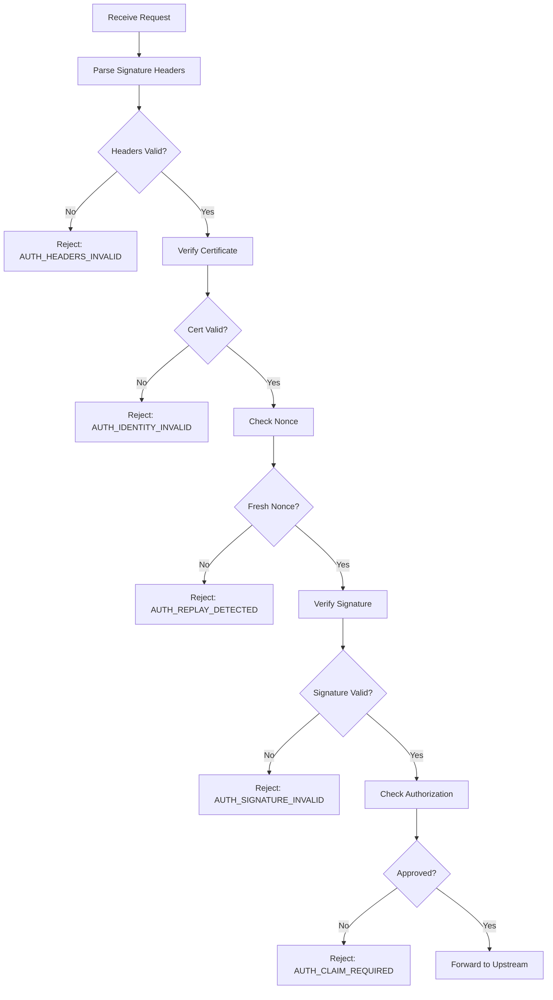

Sigilum uses a hierarchical identity model based on Decentralized Identifiers (DIDs) to provide verifiable, auditable identity for AI agents.

## Identity Hierarchy

The Sigilum identity model uses a four-level hierarchy:

```
namespace → service → agent → subject
```

**Example DID:**
```
did:sigilum:mfs:narmi#davis-agent#customer-12345
```

Breakdown:
- **Namespace:** `mfs` - The human-owned namespace (organization or individual)
- **Service:** `narmi` - The service the agent is calling (e.g., OpenAI, Linear)
- **Agent:** `davis-agent` - The specific agent instance
- **Subject:** `customer-12345` - The end user or principal triggering the action

## DID Format

### Base DID Syntax

```
did:sigilum:<namespace>
```

**Namespace Requirements:**
- Length: 3-64 characters
- Allowed characters: `a-z`, `A-Z`, `0-9`, `-`
- Must begin and end with alphanumeric character

**Examples:**
- `did:sigilum:prashanth-openai`
- `did:sigilum:acme-corp`
- `did:sigilum:johndoe123`

### DID URL with Fragments

Fragments reference specific keys, agents, or subjects:

```
did:sigilum:<namespace>:<service>#<agent>#<subject>
```

**Complete Identity Examples:**

```
did:sigilum:prashanth:openai#agent-1#user-456
did:sigilum:acme:slack#support-bot#employee-789
did:sigilum:johndee:linear#task-agent#project-123
```

<Info>
  The DID format is defined in the [`did:sigilum` Method Specification](/protocol/did-method) and conforms to W3C DID Core standards.
</Info>

## Identity Components

### 1. Namespace

The **namespace** is the root identity owned by a human or organization. It represents the entity responsible for all agent actions under that namespace.

**Characteristics:**
- Registered and owned by a human via dashboard or API
- Mapped to a DID: `did:sigilum:<namespace>`
- Can be transferred to a new owner
- Controls approval/revocation of all agent authorizations

**Creation:**

Via dashboard at [sigilum.id](https://sigilum.id) or via contract:

```solidity
registerNamespace("my-namespace")
```

### 2. Service

The **service** represents the external API or resource the agent is authorized to access.

**Examples:**
- `openai` - OpenAI API
- `linear` - Linear project management
- `slack` - Slack messaging
- `github` - GitHub repositories

**Service Registration:**

Services are registered with the Sigilum API and assigned an API key for claim submission:

```bash
POST /v1/services
{
  "name": "OpenAI Integration",
  "service_endpoint": "https://api.openai.com"
}
```

### 3. Agent

The **agent** is a specific agent instance with its own Ed25519 key pair.

**Characteristics:**
- Has unique public/private key pair
- Signs all requests with its private key
- Identified by agent key ID in requests
- Can have multiple agents per namespace

**Agent Key Format:**
- Algorithm: Ed25519
- Public key encoding: Multibase (`z` prefix for base58btc)
- Private key storage: Local encrypted storage (`~/.sigilum/identities/`)

### 4. Subject

The **subject** identifies who triggered the agent action - the authenticated human or system principal.

**Purpose:**
- Audit trail: Know which user initiated which action
- Subject-level policies: Apply different permissions per user
- MCP tool filtering: Allow/deny tools based on subject

**Subject Semantics:**

<Note>
  `sigilum-subject` should be a stable requester identifier within the namespace (e.g., user ID, employee ID, or app principal ID). Gateway policy can apply subject-level controls based on this value.
</Note>

**Default Behavior:**

When `subject` is omitted at signing time, SDKs default `sigilum-subject` to the signer namespace.

## Identity Lifecycle

### Local Identity Creation

Agents create identity locally without requiring hosted services:

```typescript
// TypeScript SDK
import * as sigilum from '@sigilum/sdk';

const identity = await sigilum.initIdentity('my-namespace');
```

```python
# Python SDK
import sigilum

identity = sigilum.init_identity('my-namespace')
```

```go
// Go SDK
import "sigilum.local/sdk-go/sigilum"

identity, err := sigilum.InitIdentity("my-namespace")
```

**Identity Storage:**

Identities are stored at:
```
~/.sigilum/identities/<namespace>/identity.json
```

**Identity Record Format:**

```json
{
  "version": "1",
  "namespace": "my-namespace",
  "did": "did:sigilum:my-namespace",
  "keyId": "key-abc123",
  "publicKey": "z6Mkf5rG...",
  "privateKey": "...",
  "certificate": "base64-encoded-cert",
  "createdAt": "2024-01-15T10:30:00Z",
  "updatedAt": "2024-01-15T10:30:00Z"
}
```

<Warning>
  Private keys are stored unencrypted in the identity file. Ensure proper file permissions (0600) and consider additional encryption for production use.
</Warning>

### Self-Certification

Sigilum uses self-signed certificates for agent identity. The certificate proves ownership of the public key by the namespace.

**Certificate Canonical Form:**

The certificate signs UTF-8 text in this exact format:

```
sigilum-certificate-v1
namespace:<namespace>
did:<did>
key-id:<keyId>
public-key:<publicKey>
issued-at:<issuedAt>
expires-at:<expiresAt-or-empty>
```

**Certificate Verification:**

1. Parse certificate from `sigilum-agent-cert` header
2. Extract namespace, DID, key ID, and public key
3. Verify signature against canonical form
4. Check expiration (if set)
5. Validate consistency with request headers

## DID Document

### Resolution

DID documents are resolved via the Sigilum API:

```bash
GET /.well-known/did/did:sigilum:prashanth-openai
GET /1.0/identifiers/did:sigilum:prashanth-openai
```

### Document Structure

```json
{
  "@context": "https://www.w3.org/ns/did/v1",
  "id": "did:sigilum:prashanth-openai",
  "verificationMethod": [
    {
      "id": "did:sigilum:prashanth-openai#key-1",
      "type": "Ed25519VerificationKey2020",
      "controller": "did:sigilum:prashanth-openai",
      "publicKeyMultibase": "z6Mkf5rG..."
    }
  ],
  "authentication": [
    "did:sigilum:prashanth-openai#key-1"
  ],
  "assertionMethod": [
    "did:sigilum:prashanth-openai#key-1"
  ],
  "service": [
    {
      "id": "did:sigilum:prashanth-openai#agent-runtime-openai",
      "type": "AgentEndpoint",
      "serviceEndpoint": "https://api.sigilum.id/v1/verify?namespace=prashanth-openai&service=openai"
    }
  ]
}
```

**Key Components:**

- **`verificationMethod`** - Public keys for signature verification (Ed25519)
- **`authentication`** - Keys that can authenticate as the DID
- **`assertionMethod`** - Keys that can make assertions/signatures
- **`service`** - Approved service authorizations with verification endpoints

### DID Document Metadata

When a namespace is deactivated:

```json
{
  "didDocumentMetadata": {
    "deactivated": true
  }
}
```

The DID remains identifiable, but active methods are empty.

## Request Signing Profile

All agent requests must include signed headers following RFC 9421.

### Required Headers

Every signed request includes:

| Header | Purpose |
|--------|--------|
| `signature-input` | RFC 9421 signature parameters |
| `signature` | Ed25519 signature over canonical request |
| `sigilum-namespace` | The namespace making the request |
| `sigilum-subject` | The end user or principal |
| `sigilum-agent-key` | Agent's public key (multibase) |
| `sigilum-agent-cert` | Self-signed certificate proving key ownership |
| `content-digest` | SHA-256 digest of request body (if present) |

### Signature Components

The signature must cover:

- HTTP method
- Request path
- All Sigilum identity headers
- `content-digest` (when body is present)

**Example Signature-Input:**

```
signature-input: sig1=("@method" "@path" "sigilum-namespace" "sigilum-subject" \
  "sigilum-agent-key" "sigilum-agent-cert" "content-digest");created=1705318200; \
  keyid="key-abc123";alg="ed25519"
```

### SDK Implementation

SDKs provide one-line signing:

```typescript
// TypeScript
import * as sigilum from '@sigilum/sdk';

const identity = await sigilum.loadIdentity('my-namespace');
const certify = sigilum.certify(identity, { subject: 'user-123' });

const response = await fetch('https://gateway/proxy/openai/chat', {
  method: 'POST',
  headers: await certify.signHeaders({
    'Content-Type': 'application/json'
  }),
  body: JSON.stringify({ prompt: 'Hello' })
});
```

```python
# Python
import sigilum
import requests

identity = sigilum.load_identity('my-namespace')
certify = sigilum.certify(identity, subject='user-123')

headers = certify.sign_headers({'Content-Type': 'application/json'})
body = {'prompt': 'Hello'}

response = requests.post(
    'https://gateway/proxy/openai/chat',
    headers=headers,
    json=body
)
```

<Info>
  All SDKs (TypeScript, Python, Go) implement the same signing profile defined in the [SDK Profile specification](/protocol/sdk-profile).
</Info>

## Verification Flow

Services and gateways verify requests in this order:



## Authorization State

### Claim Lifecycle

Authorization follows a state machine:

```
pending → approved → (active)
pending → rejected → (terminal)
approved → revoked → (terminal)
```

### Approved Claims Feed

The gateway queries the approved claims feed:

```bash
GET /v1/namespaces/claims
Authorization: Bearer <service-api-key>
```

Response:

```json
{
  "claims": [
    {
      "namespace": "my-namespace",
      "public_key": "z6Mkf5rG...",
      "service": "openai",
      "status": "approved",
      "approved_at": "2024-01-15T10:35:00Z"
    }
  ]
}
```

The gateway caches this locally and refreshes periodically.

## Identity Portability

### Cross-SDK Compatibility

All SDKs (TypeScript, Python, Go) use the same identity record format v1, ensuring:

- Identities created by one SDK can be loaded by another
- Forward-compatible field handling (unknown fields preserved)
- Consistent signing behavior across languages

### Test Vectors

Shared test vectors ensure compatibility:

- `sdks/test-vectors/http-signatures-rfc9421.json` - Signature conformance
- `sdks/test-vectors/identity-record-v1.json` - Identity format conformance

## Best Practices

<CardGroup cols={2}>
  <Card title="Namespace Naming" icon="tag">
    Use lowercase with hyphens (e.g., `acme-corp`, `john-doe`) for consistency
  </Card>
  <Card title="Subject Granularity" icon="users">
    Use stable user IDs (e.g., `user-123`, `employee-456`) for audit trails
  </Card>
  <Card title="Key Rotation" icon="rotate">
    Generate new agent keys periodically and revoke old ones
  </Card>
  <Card title="Certificate Expiry" icon="clock">
    Set expiration dates on certificates for time-bound authorizations
  </Card>
</CardGroup>

## Security Considerations

<Warning>
  **Private Key Protection**: Agent private keys should be stored with appropriate file permissions (0600) and encrypted at rest in production environments.
</Warning>

<Note>
  **Replay Protection**: Nonces are checked in-memory by the gateway with a default 60-second window. Ensure synchronized clocks between agent and gateway.
</Note>

## Next Steps

<CardGroup cols={2}>
  <Card title="Authorization Flow" icon="shield-check" href="/concepts/authorization-flow">
    Learn how authorization requests work end-to-end
  </Card>
  <Card title="SDK Profile" icon="code" href="/protocol/signing-profile">
    Read the technical SDK signing specification
  </Card>
  <Card title="DID Method" icon="book" href="/protocol/did-method">
    Dive into the full DID method specification
  </Card>
  <Card title="Quickstart" icon="rocket" href="/quickstart-managed">
    Start building with Sigilum
  </Card>
</CardGroup>