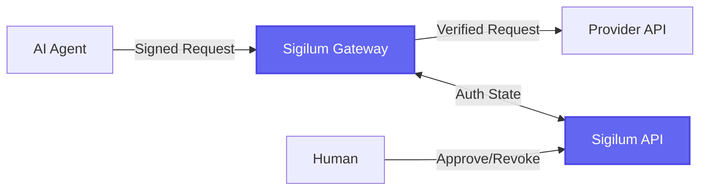

  

  

    

      <h1 className="text-4xl font-bold tracking-tight text-white sm:text-6xl md:text-7xl">
        Auditable Identity for AI Agents
      </h1>
      

        An open protocol for verifiable agent identity, signed delegation chains, and machine-speed accountability for AI systems.
      

      

        <a
          href="/quickstart-managed"
          className="rounded-lg bg-white px-6 py-3 text-base font-semibold text-[#6366f1] shadow-sm hover:bg-gray-100 focus-visible:outline focus-visible:outline-2 focus-visible:outline-offset-2 focus-visible:outline-white transition-colors"
        >
          Get Started
        </a>
        <a
          href="https://github.com/PaymanAI/sigilum"
          className="rounded-lg bg-white/10 px-6 py-3 text-base font-semibold text-white ring-1 ring-inset ring-white/20 hover:bg-white/20 transition-colors"
        >
          View on GitHub
        </a>
      

    

  

## The Problem

When an AI agent makes a call to a core system—a banking platform, hospital records, insurance claims processor, or enterprise resource planning system—the receiving system has no reliable way to answer three basic questions:

- **Which agent is this?**
- **Who authorized it to act?**
- **What chain of delegation does it represent?**

Today, the answer is usually a shared API key or service account. That identifies the platform, not the agent. Every agent running through a given integration looks identical to the downstream system.

<Note>
**The accountability gap:** In multi-agent architectures, accountability dissolves through delegation. Agent A calls Agent B, which triggers Agent C. By the time something breaks, the originating authorization has passed through enough layers that no one can say with confidence who is responsible.
</Note>

Regulated industries need **per-agent, per-action traceability**. They need to know which agent did what, under whose authority, and be able to prove it after the fact.

This is what Sigilum is for.

## How It Works

Sigilum separates **control plane** from **data plane**:

<CardGroup cols={2}>
  <Card title="Control Plane" icon="cloud">
    **Sigilum API + Dashboard**
    
    Manages identity, authorization state, approvals/revocations, and notifications.
  </Card>
  <Card title="Data Plane" icon="server">
    **Sigilum Gateway**
    
    Enforces request signing, approved-claim checks, and proxies requests to upstream providers. Provider secrets stay in your gateway.
  </Card>
</CardGroup>

### Deploy Modes

| Mode | Control Plane | Gateway | Use Case |
|------|--------------|---------|----------|
| **Managed** | Hosted at [api.sigilum.id](https://api.sigilum.id) | Customer-side (local/VM/VPC) | **Recommended.** Production use. |
| **Enterprise** | Self-hosted | Self-hosted | Full on-prem/private network. |
| **OSS-Local** | Local (open-source API) | Local | Development and testing. |

## What Sigilum Provides

<CardGroup cols={2}>
  <Card title="Verifiable Agent Identity" icon="fingerprint" iconType="duotone" color="#6366f1">
    Every AI agent gets a cryptographically verifiable identity. No more anonymous service accounts.
  </Card>
  <Card title="Signed Delegation Chains" icon="link" iconType="duotone" color="#6366f1">
    Every delegation from a human or another agent is signed, creating an auditable chain of custody.
  </Card>
  <Card title="Machine-Speed Revocation" icon="ban" iconType="duotone" color="#6366f1">
    Compromised agents can be revoked instantly. Agents operating at machine speed need revocation at machine speed.
  </Card>
  <Card title="Authorization Proof" icon="shield-check" iconType="duotone" color="#6366f1">
    When a regulator asks "who authorized this," the answer is traceable all the way back to a human decision.
  </Card>
</CardGroup>

## Quick Start

<CardGroup cols={2}>
  <Card
    title="Managed Mode"
    icon="rocket"
    href="/quickstart-managed"
    color="#6366f1"
  >
    Get started with hosted Sigilum control plane in minutes. Your gateway runs where your agent runs.
  </Card>
  <Card
    title="Self-Hosted / Local Development"
    icon="code"
    href="/quickstart-self-hosted"
    color="#6366f1"
  >
    Run the full open-source stack locally for development, testing, or fully self-hosted deployments.
  </Card>
</CardGroup>

## Architecture Overview

1. **Agent makes request** with cryptographic signature
2. **Gateway verifies** agent identity and approved claims
3. **Gateway proxies** to upstream provider (OpenAI, Linear, etc.)
4. **Humans approve/revoke** through dashboard or API
5. **All actions logged** with full delegation chain

## Why Sigilum Exists

From the [Manifesto](/manifesto):

<Accordion title="The capability curve outran the trust infrastructure">
We went from language models to autonomous personal agents in roughly four years. GPT-3 could write a convincing paragraph but couldn't do anything with it. Then came function calling, reasoning architectures, code generation engines. Now with OpenClaw, personal AI agents run locally on your operating system with full access to your files, email, browser, and code execution.

The identity and accountability layer that should have been built alongside that progression simply wasn't. We're now deploying agents into regulated, high-stakes environments using trust primitives—shared API keys, service accounts, platform-level credentials—that were designed for a world where software didn't make its own decisions.
</Accordion>

<Accordion title="Alignment is necessary but not sufficient">
Frontier model companies are doing important work to ensure models behave safely and follow instructions faithfully. But alignment alone does not solve the accountability problem.

A well-aligned agent that follows its instructions perfectly can still participate in a delegation chain that produces a catastrophic outcome, because the chain itself was never designed to be auditable or interruptible.

Alignment is the safety engineering inside the vehicle. Sigilum is the infrastructure on the road: the license that identifies who is driving, the registration that traces the vehicle to its owner, and the cameras that record what happens when something goes wrong.
</Accordion>

<Accordion title="Accountability decays at machine speed">
In multi-agent architectures, accountability dissolves through delegation. Agent A calls Agent B, which triggers Agent C, which writes and deploys code or executes a transaction. By the time something breaks, the originating authorization has passed through enough layers that no one can say with confidence who is responsible.

This is a familiar failure pattern. Financial derivatives laundered risk through layers of abstraction until it became orphaned. Agent chains do the same thing, except they do it in seconds.

Sigilum exists to make sure identity doesn't decay at machine speed.
</Accordion>

## Resources

<CardGroup cols={3}>
  <Card title="API Reference" icon="code" href="/api-reference/overview">
    REST API endpoints, authentication, and authorization flows
  </Card>
  <Card title="TypeScript SDK" icon="js" href="/sdks/typescript">
    Official TypeScript SDK with signing and delegation helpers
  </Card>
  <Card title="Python SDK" icon="python" href="/sdks/python">
    Official Python SDK for agent integration
  </Card>
  <Card title="Go SDK" icon="golang" href="/sdks/go">
    Official Go SDK for high-performance systems
  </Card>
  <Card title="CLI Reference" icon="terminal" href="/cli/overview">
    Complete command reference for the Sigilum CLI
  </Card>
  <Card title="Protocol Specs" icon="book" href="/protocol/overview">
    DID method specification and SDK signing profile
  </Card>
</CardGroup>

## Use Cases

<AccordionGroup>
  <Accordion title="Banking & Financial Services" icon="building-columns">
    Bank examiners need proof that an AI agent acting on a customer's account was specifically authorized to perform that specific action. Sigilum provides per-agent, per-action traceability with signed delegation chains from human authorization to agent execution.
  </Accordion>
  
  <Accordion title="Healthcare & HIPAA Compliance" icon="hospital">
    Healthcare auditors need to know that an agent accessing patient records had proper authorization under HIPAA. Sigilum creates an auditable trail showing which agent accessed what data, when, and under whose authority.
  </Accordion>
  
  <Accordion title="Insurance Claims Processing" icon="shield-halved">
    Insurance regulators want to know which agent processed a claim and under whose authority. Sigilum enables traceable agent actions with cryptographic proof of authorization.
  </Accordion>
  
  <Accordion title="Multi-Agent Workflows" icon="diagram-project">
    When Agent A delegates to Agent B which triggers Agent C, accountability dissolves through layers. Sigilum maintains the full delegation chain so you can reconstruct the authorization path at any point.
  </Accordion>
  
  <Accordion title="OpenClaw Personal Agents" icon="terminal">
    Personal AI agents with full system access need verifiable identity and revocable credentials. Sigilum integrates with OpenClaw to provide cryptographic agent identity for local autonomous agents.
  </Accordion>
</AccordionGroup>

## Get Started

Choose your deployment mode:

<Steps>
  <Step title="Choose Your Mode">
    - **Managed** (recommended): Hosted control plane, your gateway runs where your agent runs
    - **Self-Hosted**: Full control, run everything in your own infrastructure
    - **OSS-Local**: Development and testing with the open-source stack
  </Step>
  
  <Step title="Follow the Quickstart">
    - [Managed Mode Quickstart](/quickstart-managed)
    - [Self-Hosted Quickstart](/quickstart-self-hosted)
  </Step>
  
  <Step title="Integrate Your Agents">
    Use the [TypeScript SDK](/sdks/typescript), [Python SDK](/sdks/python), or [Go SDK](/sdks/go) to add Sigilum signing to your agents.
  </Step>
</Steps>

## Open Source

Sigilum is open source under the [MIT License](https://github.com/PaymanAI/sigilum/blob/main/LICENSE).

- **GitHub**: [github.com/PaymanAI/sigilum](https://github.com/PaymanAI/sigilum)
- **Issues**: [Report bugs or request features](https://github.com/PaymanAI/sigilum/issues)
- **Discussions**: [Join the community](https://github.com/PaymanAI/sigilum/discussions)

<Note>
**Contributing**: Sigilum is actively developed. We welcome contributions, bug reports, and feature requests. See the [contribution guidelines](https://github.com/PaymanAI/sigilum/blob/main/CONTRIBUTING.md) to get started.
</Note>

