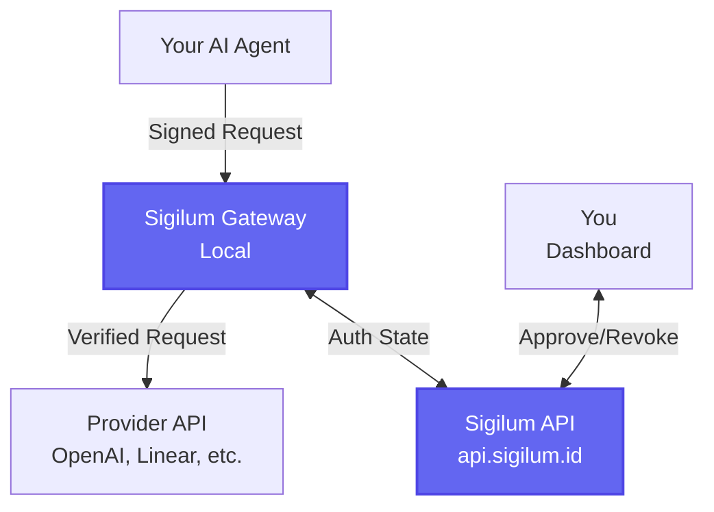

<Note>
**Managed mode** uses the hosted Sigilum control plane at [sigilum.id](https://sigilum.id). Your gateway runs where your agent runs (DigitalOcean, AWS, VPS, local machine, etc.). Provider secrets stay in your gateway.
</Note>

This is the recommended setup path for production use.

## Prerequisites

- A machine where your AI agent runs (local, VPS, cloud instance)
- Linux, macOS, or WSL2 on Windows
- Internet access to `sigilum.id` and `api.sigilum.id`

## Installation

<Steps>
  <Step title="Sign in and reserve your namespace">
    1. Open [sigilum.id](https://sigilum.id)
    2. Create an account or sign in
    3. Reserve a namespace (e.g., `johndee`)
    
    <Note>
    Your namespace is your unique identifier in the Sigilum network. Choose carefully—it will be part of your agent identities.
    </Note>
  </Step>

  <Step title="Install the Sigilum CLI">
    Run this command on the machine where your agent runs:
    
    ```bash
    curl -fsSL https://github.com/PaymanAI/sigilum/releases/latest/download/install-curl.sh | bash
    ```
    
    Reload your shell configuration:
    
    <CodeGroup>
    ```bash zsh
    source ~/.zshrc
    ```
    
    ```bash bash
    source ~/.bashrc
    ```
    </CodeGroup>
    
    Verify installation:
    
    ```bash
    sigilum --help
    ```
    
    <Tip>
    The installer downloads the latest release binary for your platform (Linux/macOS, AMD64/ARM64) and places it in `~/.sigilum/bin/`.
    </Tip>
  </Step>

  <Step title="Start the local gateway">
    ```bash
    sigilum gateway start --namespace johndee
    ```
    
    <Info>
    **What happens here:**
    - If identity doesn't exist, the gateway auto-bootstraps it
    - The gateway starts on `http://127.0.0.1:38100`
    - No JWT is required for gateway start or pairing
    - Provider secrets are stored locally in your gateway (never sent to Sigilum API)
    </Info>
    
    Verify the gateway is running:
    
    ```bash
    curl -fsS http://127.0.0.1:38100/health
    ```
    
    Expected response:
    ```json
    {"status":"ok"}
    ```
  </Step>

  <Step title="Connect gateway to dashboard">
    1. Go to the [Sigilum Dashboard](https://sigilum.id)
    2. Click **Start Pairing**
    3. Copy the pairing command shown
    4. Run it in your terminal:
    
    ```bash
    sigilum gateway connect \
      --session-id <session-id> \
      --pair-code <pair-code> \
      --namespace johndee \
      --api-url https://api.sigilum.id
    ```
    
    <Note>
    `gateway connect` ensures the gateway is running and healthy, then starts the pairing bridge in daemon mode.
    </Note>
    
    Check pairing status:
    
    ```bash
    sigilum gateway pair --status
    ```
    
    To stop the pairing daemon:
    
    ```bash
    sigilum gateway pair --stop
    ```
  </Step>

  <Step title="Add provider connections">
    In the Sigilum Dashboard, navigate to **Providers** and add your provider credentials:
    
    - **OpenAI**: API key for GPT models
    - **Linear**: API key for issue tracking
    - **Anthropic**: API key for Claude models
    - **Custom providers**: Any API you want to proxy through Sigilum
    
    <Warning>
    Provider secrets are stored **locally in your gateway**, not in the Sigilum API. The dashboard UI sends credentials directly to your gateway via the pairing bridge.
    </Warning>
  </Step>

  <Step title="Verify your setup">
    Run diagnostics:
    
    ```bash
    sigilum doctor
    ```
    
    This checks:
    - Gateway health
    - Pairing bridge status
    - Identity configuration
    - Network connectivity to Sigilum API
    
    <Tip>
    Use `sigilum doctor --json` for machine-readable output or `sigilum doctor --fix` to auto-remediate common issues.
    </Tip>
  </Step>
</Steps>

## Optional: OpenClaw Integration

If you're using [OpenClaw](https://github.com/PaymanAI/openclaw), you can onboard with a single command:

```bash
sigilum openclaw connect \
  --session-id <session-id> \
  --pair-code <pair-code> \
  --namespace johndee \
  --api-url https://api.sigilum.id
```

This performs:
1. `sigilum gateway connect` (pairs the gateway)
2. `sigilum openclaw install --mode managed --non-interactive` (installs hooks)
3. Immediate OpenClaw agent key bootstrap under `~/.openclaw/.sigilum/keys/`

<Info>
If your gateway is already paired, you can run just the OpenClaw install:

```bash
sigilum openclaw install --namespace johndee
```
</Info>

### Verify OpenClaw Integration

```bash
sigilum openclaw status
```

This shows:
- OpenClaw installation path
- Sigilum hooks installed
- Agent key status
- Gateway connection status

## Next Steps

<CardGroup cols={2}>
  <Card title="Integrate Your Agent" icon="code" href="/sdks/overview">
    Use the TypeScript, Python, or Go SDK to add Sigilum signing to your AI agent
  </Card>
  <Card title="API Reference" icon="book" href="/api-reference/overview">
    Explore the full Sigilum API for approvals, revocations, and authorization management
  </Card>
  <Card title="CLI Reference" icon="terminal" href="/cli/overview">
    Learn all available CLI commands for gateway management and service configuration
  </Card>
  <Card title="Gateway Configuration" icon="server" href="/components/gateway">
    Advanced gateway configuration, admin API, and troubleshooting
  </Card>
</CardGroup>

## Common Tasks

### Check Gateway Health

```bash
curl -fsS http://127.0.0.1:38100/health
```

### View Gateway Logs

```bash
sigilum gateway logs
```

### Restart Gateway

```bash
sigilum gateway restart --namespace johndee
```

### Update CLI and Gateway

```bash
curl -fsSL https://github.com/PaymanAI/sigilum/releases/latest/download/install-curl.sh | bash
sigilum gateway restart --namespace johndee
```

## Troubleshooting

<AccordionGroup>
  <Accordion title="Gateway won't start">
    1. Check if port 38100 is already in use:
       ```bash
       lsof -i :38100
       ```
    2. Run diagnostics:
       ```bash
       sigilum doctor --fix
       ```
    3. Check gateway logs:
       ```bash
       sigilum gateway logs
       ```
  </Accordion>
  
  <Accordion title="Pairing failed">
    1. Verify gateway is running:
       ```bash
       curl -fsS http://127.0.0.1:38100/health
       ```
    2. Check pairing status:
       ```bash
       sigilum gateway pair --status
       ```
    3. Generate a new pairing code in the dashboard and try again
  </Accordion>
  
  <Accordion title="Provider credentials not working">
    1. Verify credentials are stored in gateway:
       ```bash
       sigilum gateway providers list
       ```
    2. Check gateway logs for auth errors:
       ```bash
       sigilum gateway logs | grep -i auth
       ```
    3. Re-add the provider in the dashboard
  </Accordion>
  
  <Accordion title="Can't reach Sigilum API">
    1. Check network connectivity:
       ```bash
       curl -fsS https://api.sigilum.id/health
       ```
    2. Verify firewall rules allow outbound HTTPS
    3. If behind a corporate proxy, configure proxy settings:
       ```bash
       export HTTPS_PROXY=http://proxy.company.com:8080
       ```
  </Accordion>
</AccordionGroup>

## Architecture

In managed mode:



- **Your AI Agent**: Runs on your infrastructure, signs requests with Sigilum SDK
- **Sigilum Gateway**: Runs locally alongside your agent, stores provider secrets
- **Provider APIs**: OpenAI, Linear, Anthropic, or any custom API
- **Sigilum API**: Hosted control plane manages authorization state
- **Dashboard**: Web UI for approvals, revocations, and monitoring

## Security Model

<Note>
**Key principle**: Provider secrets never leave your gateway.
</Note>

1. **Identity**: Each agent gets a cryptographically verifiable DID (Decentralized Identifier)
2. **Signing**: Agents sign requests with their private key (stored locally)
3. **Verification**: Gateway verifies signature and checks approved claims against Sigilum API
4. **Proxy**: Gateway adds provider credentials and proxies to upstream API
5. **Audit**: All requests logged with full delegation chain

### What Sigilum API Knows

- Agent identities (DIDs)
- Approval/revocation state
- Request metadata (timestamp, service, endpoint)

### What Sigilum API Never Sees

- Provider API keys or secrets
- Request/response payloads
- Agent private keys

## Learn More

- [Protocol Specification](/protocol): DID method and signing profile
- [Security Model](/security): Threat model and trust boundaries
- [Enterprise Deployment](/enterprise): Self-hosted control plane for on-prem use
- [Manifesto](/manifesto): Why Sigilum exists and the accountability problem it solves