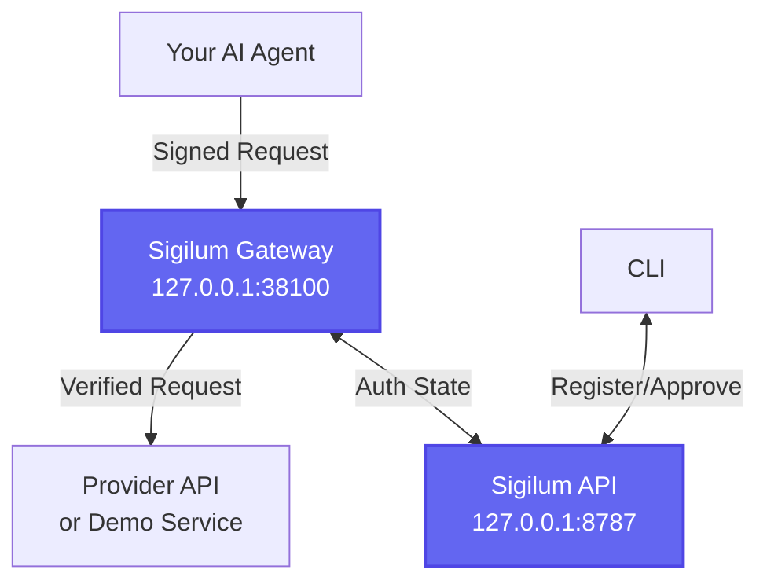

<Note>
**OSS-Local mode** runs the open-source Sigilum API and gateway locally—no hosted services required. Use this for local development, testing, or fully self-hosted deployments.
</Note>

## Prerequisites

<CardGroup cols={2}>
  <Card title="Node.js" icon="node-js">
    Version 20 or higher
  </Card>
  <Card title="pnpm" icon="package">
    Version 10.29.3 (installed via Corepack)
  </Card>
  <Card title="Go" icon="golang">
    Version 1.23 or higher
  </Card>
  <Card title="Python" icon="python">
    Version 3.11+ (optional, for Python SDK tests)
  </Card>
</CardGroup>

## Installation

<Steps>
  <Step title="Clone the repository">
    ```bash
    git clone https://github.com/PaymanAI/sigilum.git
    cd sigilum
    ```
  </Step>

  <Step title="Bootstrap dependencies">
    Enable Corepack and install dependencies:
    
    ```bash
    corepack enable && corepack prepare pnpm@10.29.3 --activate
    pnpm install
    pnpm --dir sdks/sdk-ts build
    ```
    
    <Info>
    This installs all monorepo dependencies and builds the TypeScript SDK, which is required for the API and other packages.
    </Info>
  </Step>

  <Step title="Start the local stack">
    ```bash
    ./sigilum up
    ```
    
    This starts:
    - **Sigilum API** on `http://127.0.0.1:8787`
    - **Sigilum Gateway** on `http://127.0.0.1:38100`
    
    <Tip>
    By default, gateway binaries are prebuilt to `./.local/bin/` to reduce memory pressure. Set `GATEWAY_BUILD_BINARIES=false` to force `go run` mode for fast iteration.
    </Tip>
  </Step>

  <Step title="Verify the stack is running">
    Check API health:
    
    ```bash
    curl -sf http://127.0.0.1:8787/health
    ```
    
    Check gateway health:
    
    ```bash
    curl -sf http://127.0.0.1:38100/health
    ```
    
    Both should return `{"status":"ok"}`
  </Step>
</Steps>

## Low-Memory Environments

<Warning>
If you're running in a constrained environment (e.g., 4 GB Docker container, OpenClaw instance), you may hit OOM errors on first run.
</Warning>

To avoid this, build gateway binaries separately before starting the stack:

```bash
mkdir -p ./.local/bin
(cd apps/gateway/service && go build -o ../../../.local/bin/sigilum-gateway ./cmd/sigilum-gateway)
(cd apps/gateway/service && go build -o ../../../.local/bin/sigilum-gateway-cli ./cmd/sigilum-gateway-cli)
./sigilum up
```

## Configuration

### Set Source Home for Global CLI

If you installed the `sigilum` CLI globally but want to use local API workflows:

```bash
export SIGILUM_SOURCE_HOME="$(pwd)"
```

Add this to your `.zshrc` or `.bashrc` to make it permanent.

## Working with Services

### Register a Native Service

Native services are Sigilum-aware—they verify signatures directly:

```bash
./sigilum service add \
  --service-slug my-native-service \
  --service-name "My Native Service" \
  --mode native
```

### Register a Gateway-Routed Service

Gateway-routed services use the gateway as a proxy (for existing APIs like OpenAI, Linear, etc.):

<CodeGroup>
```bash Bearer Token Auth
export LINEAR_TOKEN="lin_api_..."
./sigilum service add \
  --service-slug linear \
  --service-name "Linear" \
  --mode gateway \
  --upstream-base-url https://api.linear.app \
  --auth-mode bearer \
  --upstream-secret-env LINEAR_TOKEN
```

```bash Query Parameter Auth
export TYPEFULLY_API_KEY="tfy_..."
./sigilum service add \
  --service-slug typefully \
  --service-name "Typefully" \
  --mode gateway \
  --upstream-base-url https://mcp.typefully.com \
  --auth-mode query_param \
  --upstream-header TYPEFULLY_API_KEY \
  --upstream-secret-env TYPEFULLY_API_KEY
```
</CodeGroup>

### List Services

```bash
./sigilum service list --namespace johndee
```

## OpenClaw Integration

Install Sigilum hooks and agent key bootstrap for [OpenClaw](https://github.com/PaymanAI/openclaw):

```bash
./sigilum openclaw install --mode oss-local --namespace johndee --api-url http://127.0.0.1:8787
```

<Info>
In `oss-local` mode, the installer:
- Auto-issues a local namespace-owner JWT
- Prints the dashboard URL
- Prints the passkey setup URL for attaching a passkey to the seeded namespace
</Info>

### Verify OpenClaw Status

```bash
./sigilum openclaw status
```

## Testing

### Run End-to-End Tests

```bash
./sigilum e2e-tests
```

This:
1. Boots demo services
2. Seeds test authorization state
3. Runs the agent simulator to verify:
   - Signed approved requests succeed
   - Unsigned requests are rejected
   - Signed unapproved requests fail

### Run Diagnostics

<CodeGroup>
```bash Standard Output
./sigilum doctor
```

```bash JSON Output
./sigilum doctor --json
```

```bash Auto-Fix Issues
./sigilum doctor --fix
```
</CodeGroup>

## Local Data Paths

| Path | Contents |
|------|----------|
| `./.sigilum-workspace` | Workspace identities and bootstrap keys |
| `./.local/gateway-data` | Gateway local data store (BadgerDB) |
| `./.local/bin` | Prebuilt gateway binaries |
| `./apps/api/.wrangler/state/` | API local D1 SQLite files |

<Warning>
**Don't commit these directories.** They contain local identities, keys, and database state. They're already in `.gitignore`.
</Warning>

## Managing the Stack

### Stop the Stack

```bash
./sigilum down
```

### Restart Services

```bash
./sigilum down
./sigilum up
```

### View Logs

<CodeGroup>
```bash API Logs
tail -f ./apps/api/.wrangler/logs/wrangler.log
```

```bash Gateway Logs
./sigilum gateway logs
```
</CodeGroup>

## Authentication Management

### Issue/Refresh Local Owner JWT

```bash
./sigilum auth refresh --mode oss-local --namespace johndee
```

### Show Stored Token

```bash
./sigilum auth show --namespace johndee
```

<Note>
In `oss-local` mode, owner JWTs are issued locally with no passkey requirement. This is for development only—never use this mode in production.
</Note>

## Development Workflows

### Fast Iteration on Gateway

For rapid gateway development, use `go run` mode:

```bash
export GATEWAY_BUILD_BINARIES=false
./sigilum down
./sigilum up
```

Changes to gateway code will be reflected immediately (no rebuild needed).

### Fast Iteration on API

The API runs via Wrangler in dev mode—changes are hot-reloaded automatically.

Edit files in `apps/api/src/` and refresh your browser.

### Testing SDK Changes

After modifying the TypeScript SDK:

```bash
pnpm --dir sdks/sdk-ts build
./sigilum down
./sigilum up
```

### Running SDK Tests

<CodeGroup>
```bash TypeScript SDK
pnpm --dir sdks/sdk-ts test
```

```bash Python SDK
cd sdks/sdk-python
python -m pytest
```

```bash Go SDK
cd sdks/sdk-go
go test ./...
```
</CodeGroup>

## Architecture

In OSS-local mode:



Everything runs locally:
- **Sigilum API**: Cloudflare Workers via Wrangler with local D1 SQLite
- **Sigilum Gateway**: Go binary with BadgerDB for local storage
- **Your Agent**: Test agent or SDK integration tests
- **CLI**: `./sigilum` wrapper script for local workflows

## Next Steps

<CardGroup cols={2}>
  <Card title="Explore the API" icon="code" href="/api-reference/overview">
    Learn the REST API for approvals, revocations, and authorization management
  </Card>
  <Card title="Build with SDKs" icon="book" href="/sdks/overview">
    Integrate Sigilum signing into your agents with TypeScript, Python, or Go
  </Card>
  <Card title="CLI Reference" icon="terminal" href="/cli/overview">
    Complete command reference for the `sigilum` CLI
  </Card>
  <Card title="Protocol Specs" icon="file-code" href="/protocol/overview">
    DID method specification and SDK signing profile
  </Card>
</CardGroup>

## Troubleshooting

<AccordionGroup>
  <Accordion title="Port already in use">
    If port 8787 or 38100 is already in use:
    
    ```bash
    # Find process using port 8787
    lsof -i :8787
    
    # Find process using port 38100
    lsof -i :38100
    
    # Kill the process (replace PID)
    kill -9 <PID>
    ```
  </Accordion>
  
  <Accordion title="Build failures">
    1. Ensure you're using the correct Node.js version:
       ```bash
       node --version  # Should be >= 20
       ```
    2. Clean and reinstall:
       ```bash
       rm -rf node_modules pnpm-lock.yaml
       pnpm install
       pnpm --dir sdks/sdk-ts build
       ```
    3. Check Go version:
       ```bash
       go version  # Should be >= 1.23
       ```
  </Accordion>
  
  <Accordion title="OOM errors">
    If you see out-of-memory errors:
    
    1. Build gateway binaries separately (see "Low-Memory Environments" above)
    2. Reduce concurrent processes:
       ```bash
       export NODE_OPTIONS="--max-old-space-size=4096"
       ```
    3. Close other applications to free up RAM
  </Accordion>
  
  <Accordion title="Gateway won't start">
    1. Check if BadgerDB is locked:
       ```bash
       rm -rf ./.local/gateway-data/LOCK
       ```
    2. Rebuild gateway:
       ```bash
       cd apps/gateway/service
       go build -o ../../../.local/bin/sigilum-gateway ./cmd/sigilum-gateway
       ```
    3. Check logs:
       ```bash
       ./sigilum gateway logs
       ```
  </Accordion>
  
  <Accordion title="API database errors">
    Reset the local D1 database:
    
    ```bash
    rm -rf ./apps/api/.wrangler/state/
    ./sigilum down
    ./sigilum up
    ```
    
    <Warning>
    This deletes all local authorization state. You'll need to re-register services and re-approve agents.
    </Warning>
  </Accordion>
</AccordionGroup>

## Repository Structure

```
├── apps/
│   ├── api/          # Sigilum API (Cloudflare Workers)
│   └── gateway/      # Sigilum Gateway (Go)
├── config/           # Shared TypeScript config (@sigilum/config)
├── contracts/        # Smart contracts (Foundry)
├── docs/             # Project documentation
├── openclaw/         # OpenClaw integration (hooks, skills, installer)
├── releases/         # Release artifacts and metadata
└── sdks/             # Language SDKs (TS, Python, Go; Java placeholder)
```

### Key Files

- `./sigilum`: Main CLI wrapper for local workflows
- `apps/api/wrangler.toml`: Wrangler configuration for local API
- `apps/gateway/service/`: Go source for gateway
- `sdks/sdk-ts/`: TypeScript SDK (built to `dist/`)
- `./.sigilum-workspace/`: Local identities and keys (git-ignored)
- `./.local/gateway-data/`: Gateway database (git-ignored)

## Learn More

- [API Reference](/api-reference): Full REST API documentation
- [Gateway Reference](/gateway-reference): Gateway configuration and admin API
- [Protocol Specs](/protocol): DID method and signing profile
- [Contributing](https://github.com/PaymanAI/sigilum/blob/main/CONTRIBUTING.md): How to contribute to Sigilum
- [Manifesto](/manifesto): Why Sigilum exists